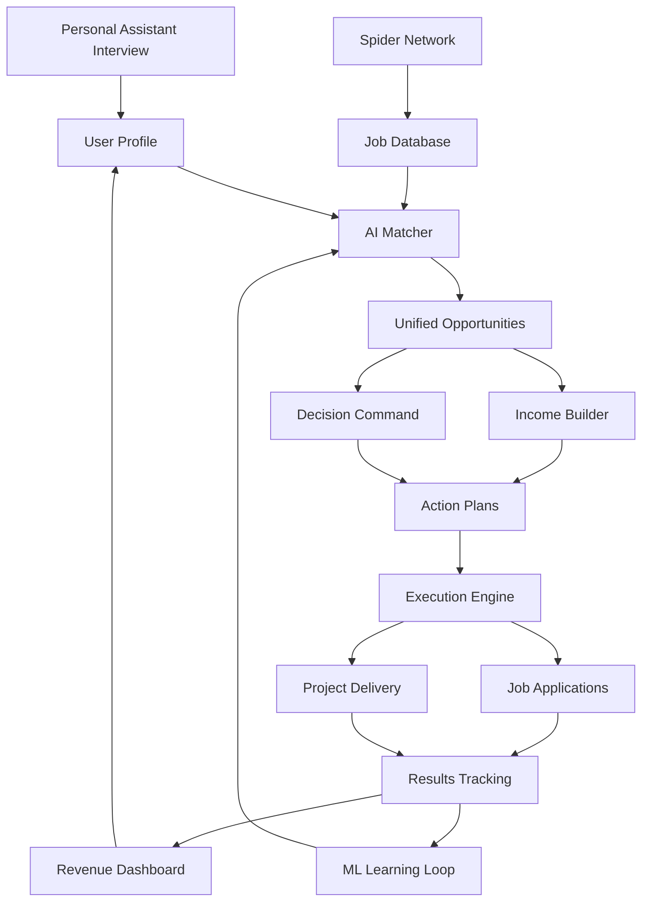

# 🔌 FULL PLATFORM INTEGRATION CHECKLIST

## Current Reality: Beautiful Parts, Missing Connections

We have amazing components but they're not talking to each other. It's like having a Ferrari engine, Lamborghini wheels, and McLaren electronics - awesome parts that don't make a car yet!

## 🔴 CRITICAL CONNECTIONS NEEDED

### 1. Personal Assistant ↔️ Income Builder
**Current**: They exist separately
**Needed**:
```javascript
// When Personal Assistant learns about user
PersonalAssistant.onProfileUpdate = (profile) => {
  IncomeBuilder.updateOpportunities(profile);
  IncomeBuilder.personalizeRecommendations(profile);
}

// When Income Builder finds opportunity
IncomeBuilder.onOpportunityFound = (opportunity) => {
  PersonalAssistant.notify(user, opportunity);
  PersonalAssistant.createActionPlan(opportunity);
}
```

### 2. AI Job Tracker ↔️ Spider Network
**Current**: Jobs are scraped but not flowing to users
**Needed**:
```python
# Real-time pipeline
SpiderNetwork.on_job_found -> AIJobTracker.analyze -> IncomeBuilder.add_opportunity -> PersonalAssistant.notify_if_match
```

### 3. Decision Command ↔️ Actual Decisions
**Current**: Beautiful UI showing mock data
**Needed**:
```python
# Connect to real decision engine
DecisionCommand.analyze_opportunity ->
  ML_Pipeline.calculate_success_probability ->
  PersonalAssistant.recommend_action ->
  User.approve ->
  ActionPlan.execute
```

### 4. Revenue Dashboard ↔️ Real Revenue
**Current**: Showing fake numbers
**Needed**:
```python
# Track actual earnings
User.completes_job ->
  Payment.received ->
  RevenueTracker.record ->
  Dashboard.update_real_numbers ->
  PersonalAssistant.celebrate_win
```

### 5. Neural Orchestra ↔️ Real Agents
**Current**: Shows 149 agents that don't exist
**Needed**:
```python
# Make agents real
Agent.register ->
  NeuralOrchestra.add_to_network ->
  Agent.start_working ->
  Orchestra.visualize_real_activity ->
  Results.flow_to_user
```

## 📊 THE MASTER DATA FLOW



## 🔧 INTEGRATION PRIORITY ORDER

### Phase 1: Core Loop (Do This First!)
1. ✅ **Personal Assistant Interview** → Builds user profile
2. ✅ **Profile** → Feeds Income Builder
3. ✅ **Income Builder** → Shows real personalized opportunities
4. ⬜ **Action Plans** → Actually executable (not just stored)
5. ⬜ **Results** → Track what actually happens

### Phase 2: Intelligence Layer
1. ⬜ **Spider Network** → Continuously feeds fresh jobs
2. ⬜ **AI Matcher** → Scores opportunities against profile
3. ⬜ **Decision Engine** → Recommends best actions
4. ⬜ **ML Pipeline** → Learns from outcomes
5. ⬜ **Advisor Network** → Provides expert guidance

### Phase 3: Execution Layer
1. ⬜ **Application Bot** → Actually applies to jobs
2. ⬜ **Follow-up Agent** → Manages communications
3. ⬜ **Negotiation Agent** → Handles offers
4. ⬜ **Delivery Agent** → Manages project execution
5. ⬜ **Payment Tracker** → Records actual revenue

### Phase 4: Visualization
1. ⬜ **Neural Orchestra** → Shows real agent activity
2. ⬜ **Revenue Dashboard** → Displays actual earnings
3. ⬜ **Control Center** → Real system metrics
4. ⬜ **Decision Command** → Live decision tracking

## 🎯 QUICK WINS (Can Do Tomorrow)

### 1. Wire Personal Assistant to Income Builder
```typescript
// In PersonalAssistant.tsx
const updateIncomeBuilder = async (profile) => {
  await fetch('/api/income-builder/update-profile', {
    method: 'POST',
    body: JSON.stringify(profile)
  });

  // Trigger opportunity refresh
  wsConnection.send({
    type: 'analyze_opportunities',
    profile: profile
  });
};
```

### 2. Connect Revenue Dashboard to LocalStorage
```typescript
// Track actual user actions
const trackRevenue = (action) => {
  const revenue = JSON.parse(localStorage.getItem('actual_revenue') || '{}');
  revenue[action.id] = {
    amount: action.value,
    date: new Date(),
    source: action.source
  };
  localStorage.setItem('actual_revenue', JSON.stringify(revenue));

  // Update dashboard
  updateRevenueDashboard(revenue);
};
```

### 3. Make Decision Command Use Real Data
```python
# In decision_command_consumer.py
async def analyze_decision(self, opportunity):
    # Get user profile
    profile = await self.get_user_profile()

    # Calculate real match score
    match_score = calculate_fit(profile, opportunity)

    # Get ML prediction
    success_prob = await ml_pipeline.predict(profile, opportunity)

    # Return real decision
    return {
        'recommendation': 'apply' if success_prob > 0.7 else 'skip',
        'confidence': success_prob,
        'reasons': generate_reasons(profile, opportunity)
    }
```

## 🚨 BIGGEST PROBLEMS TO FIX

### 1. Nothing Persists
- User profiles disappear on refresh
- Opportunities aren't saved
- Action plans vanish
- Revenue isn't tracked

**Fix**: Implement proper database storage

### 2. No Real Execution
- Can't actually apply to jobs
- Can't track real outcomes
- Can't measure success
- Can't learn from results

**Fix**: Build execution pipeline

### 3. Components Don't Share Context
- Personal Assistant doesn't know what Income Builder shows
- Decision Command doesn't know user's goals
- Revenue Dashboard doesn't know what was earned
- Neural Orchestra doesn't know what agents did

**Fix**: Implement shared state management

## 💡 THE DREAM INTEGRATION

When fully connected, here's what happens:

```
1. User completes interview
   ↓
2. Profile feeds all components
   ↓
3. Spiders find matching opportunities
   ↓
4. AI scores and ranks them
   ↓
5. Personal Assistant presents top matches
   ↓
6. User approves action
   ↓
7. Agents execute plan
   ↓
8. Applications get submitted
   ↓
9. Responses are tracked
   ↓
10. Successes generate revenue
    ↓
11. Revenue shows on dashboard
    ↓
12. ML learns what worked
    ↓
13. System gets smarter
    ↓
14. Repeat with better results
```

## 📈 SUCCESS METRICS

Once integrated, we can measure:
- **Opportunities Shown** → **Applications Sent** → **Interviews Secured** → **Jobs Won** → **Revenue Generated**

Current: 0% → 0% → 0% → 0% → $0
Goal: 100% → 50% → 10% → 2% → $10,000/month

## 🏗️ TOMORROW'S BUILD PRIORITIES

1. **Morning**: Build Personal Assistant Interview UI
2. **Afternoon**: Connect Interview → Income Builder
3. **Evening**: Wire Income Builder → Action Execution
4. **Night**: Test full flow with real data

## THE HARSH TRUTH

Right now we have:
- 🎨 Beautiful UIs that show fake data
- 🤖 Smart agents that don't execute
- 📊 Dashboards tracking nothing
- 🧠 ML that doesn't learn
- 💰 Revenue tracker with no revenue

**But we also have:**
- ✅ All the pieces needed
- ✅ Clear integration points
- ✅ Working WebSockets
- ✅ Database models
- ✅ The architecture to connect it all

## FINAL THOUGHT

*"It's like we built a rocket ship with all the parts but forgot to connect the fuel line to the engine. Tomorrow, we connect that line and launch!" 🚀*

---

**Next Agent Note**: Start with Personal Assistant Interview → Income Builder connection. That's the MVP that actually helps users!