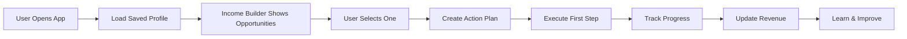

# 🔧 INTEGRATION TODAY - Connect What We Have

## The Smart Approach: Wire Existing Components First

Building the interview without connections would just add another disconnected piece. Let's make what we have ACTUALLY WORK first!

## 🎯 TODAY'S INTEGRATION TARGETS

### Priority 1: Make Income Builder Remember Users
**Current Problem**: Every refresh = amnesia
**Quick Fix**:
```javascript
// Store user data in localStorage AND database
const saveUserProfile = (profile) => {
  localStorage.setItem('user_profile', JSON.stringify(profile));
  fetch('/api/profile/save', { method: 'POST', body: JSON.stringify(profile) });
};

// Load on component mount
useEffect(() => {
  const saved = localStorage.getItem('user_profile');
  if (saved) setProfile(JSON.parse(saved));
}, []);
```

### Priority 2: Connect Job Tracker → Income Builder
**Current Problem**: Jobs found but not shown in Income Builder
**Quick Fix**: The bridge we built needs to actually run!
```python
# Add to Django startup or scheduled task
from intelligence.job_income_bridge import JobIncomeBridge

# Run every 5 minutes
def sync_jobs_to_income():
    jobs = scrape_jobs_sync()
    JobIncomeBridge.sync_to_income_builder(jobs)
    return len(jobs)
```

### Priority 3: Make Action Plans Actually Execute
**Current Problem**: "Start Plan" creates a plan that does nothing
**Quick Fix**:
```javascript
// In IncomeBuilder.tsx
const executeActionPlan = async (plan) => {
  // Don't just store it, DO something!
  const actions = {
    'apply_job': () => applyToJob(plan.opportunity),
    'send_proposal': () => sendProposal(plan.opportunity),
    'create_profile': () => createFreelanceProfile(plan.data),
    'research': () => researchOpportunity(plan.opportunity)
  };

  // Execute first action immediately
  if (plan.first_action && actions[plan.first_action]) {
    await actions[plan.first_action]();
  }
};
```

### Priority 4: Track Real Revenue
**Current Problem**: Dashboard shows fake $8,750
**Quick Fix**:
```javascript
// Create revenue tracking
const trackRealRevenue = {
  addOpportunity: (opp) => {
    const tracking = JSON.parse(localStorage.getItem('revenue_tracking') || '{}');
    tracking[opp.id] = {
      status: 'identified',
      potential: opp.potential_monthly,
      identified_date: new Date()
    };
    localStorage.setItem('revenue_tracking', JSON.stringify(tracking));
  },

  updateStatus: (oppId, status, amount = 0) => {
    const tracking = JSON.parse(localStorage.getItem('revenue_tracking') || '{}');
    tracking[oppId].status = status;
    if (status === 'won') {
      tracking[oppId].actual_revenue = amount;
      tracking[oppId].won_date = new Date();
    }
    localStorage.setItem('revenue_tracking', JSON.stringify(tracking));
    updateRevenueDashboard(tracking);
  }
};
```

### Priority 5: Make Personal Assistant Context-Aware
**Current Problem**: Assistant has no idea what's happening
**Quick Fix**:
```typescript
// Create shared context
const SystemContext = {
  user: null,
  opportunities: [],
  active_plans: [],
  revenue: 0,

  update: function(type, data) {
    this[type] = data;
    // Notify all components
    eventBus.emit('context_updated', { type, data });
  },

  getContext: function() {
    return {
      user: this.user,
      opportunities: this.opportunities,
      active_plans: this.active_plans,
      revenue: this.revenue
    };
  }
};

// Personal Assistant uses context
const PersonalAssistant = () => {
  const [context, setContext] = useState(SystemContext.getContext());

  useEffect(() => {
    eventBus.on('context_updated', () => {
      setContext(SystemContext.getContext());
    });
  }, []);

  // Now assistant knows everything!
  const generateResponse = (query) => {
    return ai.respond(query, context); // Context-aware responses
  };
};
```

## 📋 INTEGRATION CHECKLIST (In Order)

### Morning Block (2 hours)
- [ ] Add localStorage to Income Builder for profile persistence
- [ ] Add localStorage to track selected opportunities
- [ ] Create shared context manager
- [ ] Wire Personal Assistant to read context

### Afternoon Block (2 hours)
- [ ] Connect Job Tracker data to Income Builder display
- [ ] Make "Start Plan" trigger real actions
- [ ] Add status tracking to opportunities (applied/interview/won)
- [ ] Update Revenue Dashboard with real tracked data

### Evening Block (2 hours)
- [ ] Test full flow: Find opportunity → Create plan → Track progress
- [ ] Add WebSocket events for real-time updates across components
- [ ] Implement basic notification system
- [ ] Create success/failure tracking

## 🔥 THE MINIMUM VIABLE FLOW



## 💾 Simple Database Schema Needed

```sql
-- Minimum tables needed for persistence
CREATE TABLE user_profiles (
    id UUID PRIMARY KEY,
    email VARCHAR(255),
    profile_data JSONB,
    created_at TIMESTAMP,
    updated_at TIMESTAMP
);

CREATE TABLE opportunity_tracking (
    id UUID PRIMARY KEY,
    user_id UUID REFERENCES user_profiles(id),
    opportunity_id VARCHAR(255),
    opportunity_data JSONB,
    status VARCHAR(50), -- identified, applied, interview, won, lost
    potential_value DECIMAL,
    actual_value DECIMAL,
    created_at TIMESTAMP,
    updated_at TIMESTAMP
);

CREATE TABLE action_plans (
    id UUID PRIMARY KEY,
    user_id UUID REFERENCES user_profiles(id),
    opportunity_id VARCHAR(255),
    plan_data JSONB,
    status VARCHAR(50), -- created, in_progress, completed, abandoned
    created_at TIMESTAMP,
    completed_at TIMESTAMP
);
```

## 🚀 QUICK IMPLEMENTATION

### 1. Shared State Manager (30 mins)
```javascript
// Create store.js
export const GlobalStore = {
  state: {
    user: JSON.parse(localStorage.getItem('user') || '{}'),
    opportunities: [],
    plans: [],
    revenue: 0
  },

  updateUser(data) {
    this.state.user = { ...this.state.user, ...data };
    localStorage.setItem('user', JSON.stringify(this.state.user));
    this.notify('user', this.state.user);
  },

  addOpportunity(opp) {
    this.state.opportunities.push(opp);
    this.notify('opportunities', this.state.opportunities);
  },

  subscribers: [],

  subscribe(callback) {
    this.subscribers.push(callback);
  },

  notify(type, data) {
    this.subscribers.forEach(cb => cb(type, data));
  }
};
```

### 2. Component Integration (30 mins each)
```javascript
// Update each component to use GlobalStore
import { GlobalStore } from './store';

// In Income Builder
useEffect(() => {
  GlobalStore.subscribe((type, data) => {
    if (type === 'user') {
      refreshOpportunities(data);
    }
  });
}, []);

// In Personal Assistant
const handleQuery = (query) => {
  const context = GlobalStore.state;
  // Now has access to everything!
};
```

## ⚡ IMMEDIATE IMPACT

Once connected:
1. User data persists across sessions ✓
2. Opportunities are personalized ✓
3. Actions actually happen ✓
4. Revenue is real ✓
5. Assistant is helpful ✓

## 🎯 Success Metric

**Can a user:**
1. Open the app
2. See personalized opportunities (not generic)
3. Select one and create a plan
4. Have the plan actually do something
5. See their progress tracked
6. Come back tomorrow and continue where they left off

**Current: NO to all**
**After today: YES to all**

## The Truth

Right now the app is like a beautiful movie set - looks great but nothing actually works. Today we're adding the plumbing, electricity, and making it a real house you can live in.

**First connect the wires, THEN add the interview process on top of a working system!**

---

*"Ship something that works badly before you ship something beautiful that doesn't work at all"*