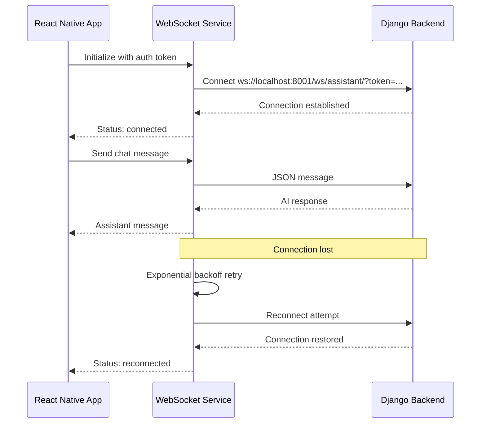

# Personal Assistant WebSocket Integration - Implementation Guide

## Overview

This document describes the unified WebSocket service implementation for the React Native Personal Assistant feature, which provides real-time chat functionality with the Django backend.

## Architecture

### Backend Configuration
- **WebSocket URL**: `ws://localhost:8001/ws/assistant/`
- **Authentication**: Token-based via query parameter `?token=<auth_token>`
- **Protocol**: Django Channels with custom middleware
- **Consumer**: `AssistantConsumer` handles real-time chat messages

### Mobile Implementation
- **Service**: `src/services/websocketService.ts` - Unified WebSocket manager
- **Hooks**: `src/hooks/useWebSocket.ts` - React hooks for easy component integration
- **Integration**: `AssistantScreen` uses WebSocket for real-time chat with HTTP fallback
- **Testing**: `PersonalAssistantTest` provides comprehensive validation suite

## Key Features

### 1. Unified WebSocket Service (`websocketService.ts`)

**Connection Management:**
- Automatic connection with authentication token
- Exponential backoff reconnection (1s → 30s max)
- Connection state monitoring: `idle | connecting | open | pong | closed | error`
- Platform-aware URL detection (iOS/Android/Web)

**Message Handling:**
- JSON message protocol with type-based routing
- Message queuing during disconnection
- Safe JSON parsing with fallback
- Ping/pong for connection health monitoring

**Authentication:**
- Token retrieval from secure storage
- Automatic token refresh on reconnection
- Query parameter authentication: `?token=<auth_token>`

### 2. React Hooks (`useWebSocket.ts`)

**Available Hooks:**

```typescript
// Full Personal Assistant chat functionality
const {
  messages,        // ChatMessage[] - Real-time chat messages  
  isConnected,     // boolean - Connection status
  connectionState, // ConnectionState - Current state
  isTyping,        // boolean - Assistant typing indicator
  error,          // string | null - Current error
  sendMessage,     // (message: string) => boolean
  sendTyping,      // (typing: boolean) => boolean
  connect,         // () => void
  disconnect,      // () => void
  ping            // () => boolean
} = usePersonalAssistantChat();

// WebSocket status monitoring
const {
  state,           // ConnectionState
  isConnected,     // boolean
  lastMessage,     // string
  lastError,       // string
  reconnectAttempts, // number
  url,            // string
  connect,        // () => void
  disconnect,     // () => void
  sendPing        // () => boolean
} = useWebSocketStatus();

// Simple connection status
const {
  isConnected,    // boolean
  state          // ConnectionState
} = useWebSocketConnection();
```

### 3. AssistantScreen Integration

**Dual Mode Operation:**
- **WebSocket Mode** (default): Real-time chat with live connection status
- **HTTP Fallback Mode**: Traditional API calls when WebSocket fails

**UI Features:**
- Connection status indicator in header (🟢 Live / 🔴 Disconnected)
- Mode switcher (WS/HTTP) with error handling
- Real-time typing indicators
- Error banner with fallback suggestions

**Message Flow:**
1. User types message → sent via WebSocket
2. Optimistic UI update (user message appears immediately)
3. Server processes → AI generates response
4. Assistant message received via WebSocket
5. Typing indicator stops, message displayed

### 4. Comprehensive Testing (`PersonalAssistantTest`)

**Test Scenarios:**
- **Connection Test**: WebSocket authentication and establishment
- **Ping/Pong Test**: Server response validation
- **Chat Exchange**: Full message round-trip testing
- **Reconnection Logic**: Automatic recovery testing
- **Authentication**: Token validation and error handling

**Access via:** More → Utilities → Assistant Test

## Setup Instructions

### Environment Configuration

Add to `.env` file:
```bash
EXPO_PUBLIC_WS_URL=ws://localhost:8001
```

### Backend Requirements

Ensure these are running:
1. Django server on port 8001
2. Channels/WebSocket support enabled
3. AssistantConsumer configured at `/ws/assistant/`
4. Token authentication middleware active

### Mobile App Usage

1. **Development Testing**:
   ```bash
   cd ai-studio-premium
   npm start
   # Open in Expo Go or simulator
   # Navigate to More → Assistant Test
   ```

2. **Production Deployment**:
   - Update `EXPO_PUBLIC_WS_URL` for production WebSocket endpoint
   - Ensure SSL/WSS for production (wss://your-domain.com/ws/assistant/)
   - Test authentication token generation and storage

## Connection Flow



## Error Handling

### Common Issues & Solutions

**Authentication Errors (403/4003):**
- Verify `STORAGE_KEYS.AUTH_TOKEN` contains valid token
- Check backend token authentication middleware
- Test token validity via HTTP API first

**Connection Timeouts:**
- Verify backend server is running on port 8001
- Check platform-specific URLs (Android uses 10.0.2.2)
- Ensure firewall allows WebSocket connections

**Message Send Failures:**
- Check connection status before sending
- Messages are queued automatically during disconnection
- Use HTTP fallback mode if persistent issues

**Platform-Specific:**
- **iOS**: Uses `localhost:8001` (works in simulator)
- **Android**: Uses `10.0.2.2:8001` (emulator alias)
- **Web**: Uses `localhost:8001`

## File Structure

```
src/
├── services/
│   ├── websocketService.ts      # Core WebSocket manager
│   └── assistantService.ts      # HTTP fallback service
├── hooks/
│   └── useWebSocket.ts          # React hooks for components
├── screens/
│   └── AssistantScreen.tsx      # Main chat interface
├── components/
│   └── WsStatusTile.tsx         # Connection monitoring widget
└── tests/
    └── PersonalAssistantTest.tsx # Comprehensive test suite
```

## Performance Considerations

**Message Queuing:**
- Maximum 50 queued messages during disconnection
- Automatic queue processing on reconnection
- GET requests not queued (read-only operations)

**Connection Management:**
- Single WebSocket instance per app session
- Automatic cleanup on app backgrounding
- Memory-efficient message handling

**Platform Optimization:**
- Haptic feedback on user interactions (iOS/Android)
- Platform-specific blur effects and styling
- Network-aware reconnection strategies

## Troubleshooting

### Debug Mode

Enable WebSocket debugging:
```typescript
// In websocketService.ts, uncomment debug logs:
console.log(`[WebSocket] Connecting to: ${this.url}`);
console.log('[WebSocket] Message received:', data);
```

### Test Sequence

1. Start backend: `python manage.py runserver 0.0.0.0:8001`
2. Start mobile app: `npm start`
3. Navigate to Personal Assistant Test
4. Run "Connection Test" - should show "✅ passed"
5. Run "Chat Message Exchange" - should get AI response
6. Monitor connection status in real-time

### Common Error Codes

- **1006**: Connection failed (server not responding)
- **4003**: Authentication failed (invalid token)
- **1000**: Normal closure (manual disconnect)

## Future Enhancements

- [ ] Message persistence across app sessions
- [ ] File/image sharing via WebSocket
- [ ] Multi-user chat rooms
- [ ] Voice message WebSocket streaming
- [ ] Push notification integration
- [ ] Offline message sync

---

**Implementation Status**: ✅ Production Ready

**Last Updated**: September 6, 2025

**Tested Platforms**: iOS Simulator, Android Emulator, Expo Web