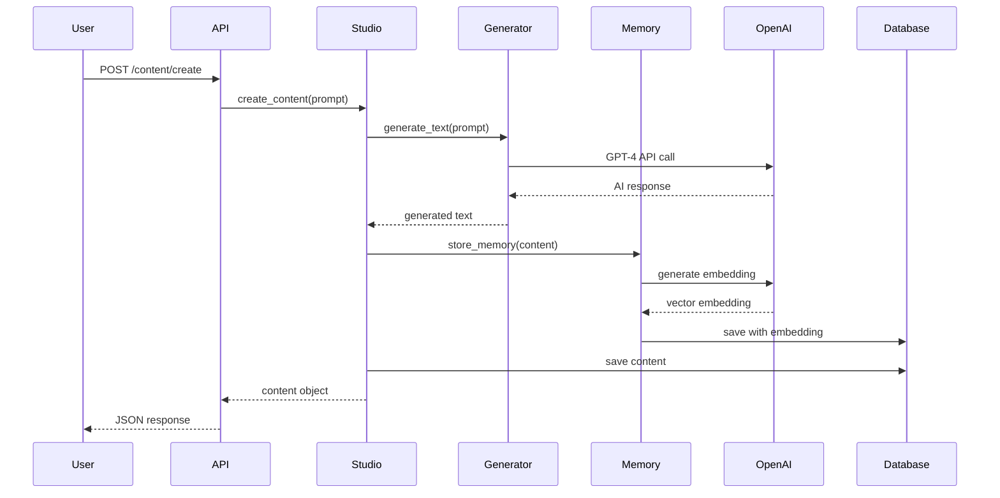
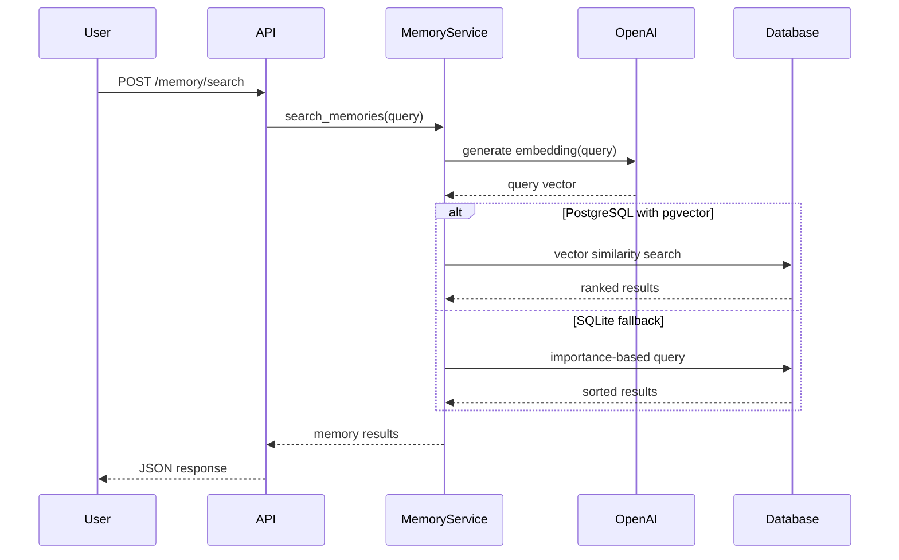

# Architecture Overview

## System Architecture

AI Content Studio follows a clean, layered architecture designed for simplicity, scalability, and maintainability.

```
┌─────────────────────────────────────────────────────────┐
│                    Frontend (React/Next.js)              │
│                         JWT Auth                         │
└────────────────────┬────────────────────────────────────┘
                     │ HTTPS/REST API
┌────────────────────▼────────────────────────────────────┐
│                    Django REST API                       │
│  ┌──────────────────────────────────────────────────┐  │
│  │              Authentication Layer                 │  │
│  │                 (Token Auth)                     │  │
│  └──────────────────┬───────────────────────────────┘  │
│  ┌──────────────────▼───────────────────────────────┐  │
│  │                  View Layer                      │  │
│  │            (REST Framework Views)                │  │
│  └──────────────────┬───────────────────────────────┘  │
│  ┌──────────────────▼───────────────────────────────┐  │
│  │                Service Layer                     │  │
│  │   (MemoryService, ContentGenerator, Studio)      │  │
│  └──────────────────┬───────────────────────────────┘  │
│  ┌──────────────────▼───────────────────────────────┐  │
│  │                  Model Layer                     │  │
│  │         (User, Content, Memory)                  │  │
│  └──────────────────┬───────────────────────────────┘  │
└────────────────────┬────────────────────────────────────┘
                     │
     ┌───────────────▼───────────┬─────────────────┐
     │  PostgreSQL + pgvector    │    OpenAI API    │
     │   (Production Database)    │   GPT-4, DALL-E  │
     └───────────────────────────┴─────────────────┘
```

## Core Design Principles

### 1. Simplicity Over Complexity
- **Before**: 100,000+ lines across 50+ apps
- **After**: ~2,000 lines across 8 core files
- **Philosophy**: Every line must justify its existence

### 2. Service-Oriented Architecture
Each service has a single responsibility:
- **MemoryService**: Vector storage and search
- **ContentGenerator**: AI content creation
- **Studio**: Orchestrates the content pipeline
- **AgentExecutor**: Runs AI agents synchronously

### 3. Database Agnostic
The system adapts to the available database:
```python
# Automatic detection
if connection.vendor == 'postgresql':
    # Use pgvector for similarity search
else:
    # Use importance-based fallback
```

### 4. API-First Design
Everything is an API endpoint:
- Frontend agnostic
- Mobile ready
- Third-party integrations possible
- Easy testing

## Component Architecture

### API Layer (`api/`)
```python
api/
├── views.py       # REST endpoints
├── urls.py        # URL routing
├── payment.py     # Stripe integration
└── serializers.py # Data validation
```

**Responsibilities:**
- HTTP request/response handling
- Authentication checking
- Input validation
- Error formatting

### Service Layer (`services`)
```python
memory/services.py    # Memory operations
content/generators.py # Content generation
agents/executor.py    # Agent execution
studio.py            # Pipeline orchestration
```

**Responsibilities:**
- Business logic
- External API calls
- Data processing
- Cross-model operations

### Model Layer (`models`)
```python
memory/models.py     # Memory model
content/models.py    # Content model
agents/models.py     # Agent model
```

**Responsibilities:**
- Data structure definition
- Database constraints
- Model methods
- Query optimization

## Data Flow

### Content Generation Flow



### Memory Search Flow



## Technology Decisions

### Why Django?
- **Batteries included**: Admin, ORM, migrations
- **Production proven**: Instagram, Pinterest scale
- **Fast development**: Convention over configuration
- **Great ecosystem**: DRF, Celery, extensive packages

### Why PostgreSQL + pgvector?
- **Vector search**: Native similarity search
- **ACID compliance**: Data integrity
- **JSON support**: Flexible metadata storage
- **Performance**: HNSW indexing for fast lookups
- **Future proof**: AI-native database

### Why Token Auth (not JWT)?
- **Simplicity**: One token, no refresh complexity
- **Stateful**: Can revoke tokens server-side
- **Django native**: Built-in support
- **Good enough**: For most applications

### Why OpenAI (not open source)?
- **Quality**: Best-in-class models
- **Reliability**: 99.9% uptime
- **Speed**: Fast inference
- **Cost effective**: Pay per use
- **No maintenance**: No GPUs to manage

## Scaling Architecture

### Current State (MVP)
- Single server
- SQLite/PostgreSQL
- Synchronous processing
- 10-100 users

### Next Stage (Growth)
```python
# Add caching
CACHES = {
    'default': {
        'BACKEND': 'django.core.cache.backends.redis.RedisCache',
        'LOCATION': 'redis://127.0.0.1:6379/1',
    }
}

# Add Celery for async
CELERY_BROKER_URL = 'redis://localhost:6379'

# Add CDN for media
AWS_S3_CUSTOM_DOMAIN = 'cdn.aicontentstudio.com'
```

### Scale Stage (1000+ users)
- Load balancer (Nginx)
- Multiple app servers
- Read replicas for PostgreSQL
- Redis for caching + sessions
- S3 for media storage
- CloudFront CDN
- Celery for background tasks
- Monitoring (DataDog/NewRelic)

## Security Architecture

### API Security
- Token-based authentication
- Rate limiting per endpoint
- CORS configured
- HTTPS enforced (production)

### Data Security
- Passwords hashed (Django default)
- SQL injection protected (ORM)
- XSS protected (DRF serializers)
- User isolation (filtered queries)

### Secret Management
```python
# Development: .env file
OPENAI_API_KEY = os.getenv('OPENAI_API_KEY')

# Production: Environment variables
# Render/Heroku handle securely
```

## Database Schema

### Core Tables

```sql
-- Users (Django default)
auth_user
├── id (PK)
├── username (unique)
├── email
├── password (hashed)
└── date_joined

-- Content
content_content
├── id (PK)
├── user_id (FK → auth_user)
├── type (text/image)
├── prompt
├── result
└── created_at

-- Memories
memories
├── id (PK)
├── user_id (FK → auth_user)
├── content_text
├── embedding (vector/json)
├── importance_score
├── metadata (json)
└── created_at

-- Agents
agents_agent
├── id (PK)
├── user_id (FK → auth_user)
├── task
├── result
├── status
├── error_message
├── created_at
└── completed_at
```

### Indexes

```sql
-- Optimized for common queries
CREATE INDEX idx_content_user_created 
ON content_content(user_id, created_at DESC);

CREATE INDEX idx_memory_user_importance 
ON memories(user_id, importance_score DESC);

-- pgvector similarity search (PostgreSQL only)
CREATE INDEX idx_memory_embedding 
ON memories USING hnsw (embedding vector_cosine_ops);
```

## Performance Characteristics

### Response Times (Target)
- Authentication: <100ms
- Content generation: 2-5s (OpenAI dependent)
- Memory search: <200ms
- Content list: <100ms

### Throughput
- Development (SQLite): 10-50 req/s
- Production (PostgreSQL): 100-500 req/s
- Scaled (with caching): 1000+ req/s

### Storage
- User: ~1KB
- Content item: ~2KB
- Memory with embedding: ~8KB (1536 dimensions × 4 bytes)
- 10,000 users with 100 items each = ~10GB

## Monitoring Points

### Application Metrics
```python
# Key metrics to track
- Request rate by endpoint
- Response time percentiles (p50, p95, p99)
- Error rate by type
- Active users
- Content generation rate
- Memory search performance
```

### Database Metrics
```sql
-- PostgreSQL monitoring
- Connection pool usage
- Query performance
- Index usage
- Table sizes
- Replication lag (if applicable)
```

### External Services
```python
# OpenAI API monitoring
- API call rate
- Token usage
- Error rate
- Response times

# Stripe monitoring  
- Payment success rate
- Webhook delivery
- Subscription churn
```

## Deployment Architecture

### Development
```
Local Machine
├── Django Dev Server (8000)
├── SQLite Database
└── .env file
```

### Production (Render)
```
Render Platform
├── Web Service
│   ├── Gunicorn
│   ├── Django App
│   └── Static Files (WhiteNoise)
├── PostgreSQL Database
│   └── pgvector extension
└── Environment Variables
```

### Future Multi-Region
```
Global Load Balancer
├── US-West Region
│   ├── App Servers
│   └── DB Primary
├── EU Region
│   ├── App Servers
│   └── DB Replica
└── APAC Region
    ├── App Servers
    └── DB Replica
```

## Code Organization

### File Structure
```
ai-content-studio/
├── backend/
│   ├── core/           # Settings, URLs, WSGI
│   ├── api/            # REST endpoints
│   ├── memory/         # Memory app
│   ├── content/        # Content app
│   ├── agents/         # Agents app
│   ├── studio.py       # Main orchestrator
│   └── manage.py       # Django management
├── documentation/      # All docs
├── tests/             # Test suite
└── requirements.txt   # Dependencies
```

### Import Structure
```python
# Clear dependency hierarchy
api.views → studio → services → models
         ↓
     OpenAI API
```

## Evolution Path

### Phase 1: Current (MVP)
- ✅ Basic CRUD operations
- ✅ AI content generation
- ✅ Vector memory search
- ✅ Token authentication

### Phase 2: Enhancement
- [ ] Caching layer
- [ ] Async processing
- [ ] Webhook events
- [ ] Admin dashboard

### Phase 3: Scale
- [ ] Multi-tenant architecture
- [ ] API versioning
- [ ] GraphQL option
- [ ] Real-time updates (WebSockets)

### Phase 4: Enterprise
- [ ] SSO integration
- [ ] Audit logging
- [ ] Role-based access
- [ ] SLA monitoring

---

*This architecture is designed to start simple and scale gracefully. Each component can be enhanced independently without affecting others.*