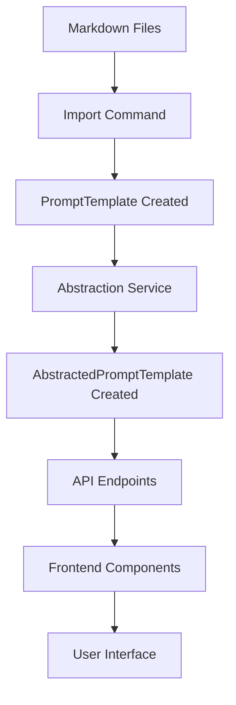

# 📚 Template Library - Complete Architecture Documentation

**Date**: January 18, 2025  
**Status**: ✅ Operational with Frontend Display Issue  
**System**: Donkey Betz Prompt Management System

## 🎯 Overview

The Template Library is a sophisticated prompt management system that imports, abstracts, and serves AI prompt templates from 14+ platforms. It transforms platform-specific prompts into reusable, platform-agnostic building blocks through dynamic variable substitution.

## 📊 Architecture Components

### 1. Data Import Pipeline

#### Sources
- **14 Platforms**: Anthropic, OpenAI, Cursor, Windsurf, Devin, Google, Mistral, Replit, XAI, Hume, Manus, MultiOn, Donkey Betz, Other
- **66 Templates**: Imported from markdown files
- **34 Abstracted**: Successfully converted to dynamic templates

#### Import Process
```python
# Management command: import_prompt_sets.py
- Scans markdown files by platform
- Extracts prompt name, content, components
- Creates PromptTemplate records
- Triggers abstraction process
- Stores in PostgreSQL database
```

### 2. Database Schema

#### Core Tables

**prompting_system_prompttemplate**
```sql
- id (UUID)
- name (VARCHAR)
- template (TEXT) - Original content
- category (VARCHAR) - agent/system/task/etc
- source_platform (VARCHAR)
- version (INT)
- is_active (BOOL)
- usage_count (INT)
- avg_response_quality (FLOAT)
- embedding (VECTOR) - Currently unused (0% coverage)
```

**abstracted_prompt_templates**
```sql
- id (BIGINT)
- original_template_id (UUID) - FK to PromptTemplate
- abstracted_template (TEXT) - Content with {{variables}}
- variables (JSONB) - Variable definitions
- tool_references (JSONB) - Generic tool mappings
- platform_config (JSONB) - Original values
- created_at (TIMESTAMP)
- updated_at (TIMESTAMP)
```

### 3. Abstraction System

#### Variable Patterns
```python
# Platform-specific → Generic variables
"You are Claude" → "{{agent_name}}"
"Anthropic's CLI" → "{{company}}'s {{interface_name}}"
"knowledge cutoff: 2024-04" → "knowledge cutoff: {{knowledge_cutoff}}"
"Claude 3.5 Sonnet" → "{{model_name}}"
```

#### Tool Mappings
```python
# Platform tools → Generic categories
'edit_file' → 'file_editor'
'shell_exec' → 'terminal'
'codebase_search' → 'code_search'
'browser_preview' → 'web_preview'
```

#### Abstraction Service (`prompt_abstraction.py`)
- Detects platform-specific patterns
- Replaces with variable placeholders
- Extracts tool references
- Stores original values in platform_config

### 4. API Layer

#### Endpoints

**List Templates**
```
GET /api/prompting/templates/discover/
- Returns all templates with metadata
- Supports filtering by platform, category, search
- Includes performance metrics
```

**Preview Template**
```
GET /api/prompting/templates/{id}/preview/
- Returns original template content
- Includes components and metrics
- Shows import information
```

**Get Abstracted Templates**
```
GET /api/prompting/templates/abstracted_templates/
- Returns templates that have abstractions
- ⚠️ Only returns metadata, not content
```

**Get Specific Abstraction**
```
GET /api/prompting/templates/{id}/abstracted/
- Returns full abstracted content with variables
- Includes variable definitions and tool references
```

### 5. Frontend Components

#### Template Library Page (`TemplateLibrary.tsx`)
- Main container with statistics
- Shows 66 templates, 34 dynamic
- Integrates TemplateExplorer component

#### TemplateExplorer Component
- **Toggle**: Switch between regular/dynamic templates
- **Grid Display**: Cards with platform badges
- **Filtering**: By platform, category, search
- **Preview Modal**: Shows template content
- **Selection**: Single/multiple/none modes

### 6. Data Flow



## 🔍 Current Issues

### Dynamic Templates Not Showing Variables

**Problem**: When toggling to "Dynamic Templates", the content shown is identical to original templates instead of showing abstracted versions with `{{variables}}`.

**Root Cause**:
1. `/abstracted_templates/` endpoint only returns metadata, not abstracted content (line 343-352 in views.py)
2. Preview modal fetches original content via `/preview/` endpoint (line 126 in TemplateExplorer.tsx)
3. Frontend never calls `/abstracted/` to get variable content (line 718 shows original template)

**Evidence**:
- Database contains proper abstractions with variables ✅
- API endpoint `/abstracted/` returns correct data ✅ (tested with Django shell)
- Frontend displays wrong content ❌ (always shows previewTemplate.template)

## 📈 Statistics

### Templates
- **Total**: 66 templates
- **Abstracted**: 34 (51.5%)
- **With Variables**: 14 (21.2%)
- **With Tools**: 13 (19.7%)

### Variables Found
- `{{agent_name}}`: Most common
- `{{company}}`: Organization references
- `{{model_name}}`: Model identifiers
- `{{knowledge_cutoff}}`: Training dates
- `{{tool:*}}`: Tool references

### Platform Distribution
```
Anthropic: 15 templates
OpenAI: 12 templates  
Cursor: 8 templates
Windsurf: 6 templates
Others: 25 templates
```

## 🔧 Metadata Structure

### Current Metadata
- **Platform**: Source AI platform
- **Category**: agent/system/task/component/enhancement
- **Version**: Template versioning
- **Performance**: usage_count, avg_quality, avg_time
- **Variables**: Extracted placeholders
- **Tools**: Referenced capabilities

### Enhancement Opportunities
1. **Embeddings**: Generate for semantic search
2. **Domain Tags**: Technical, creative, business
3. **Complexity**: Simple, intermediate, advanced
4. **Language Support**: Programming languages
5. **Component Breakdown**: Reusable parts

## 🚀 Recommendations

### Immediate Fix for Dynamic Templates
```typescript
// In TemplateExplorer.tsx handlePreview function (replace lines 124-132)
const handlePreview = async (templateId: string) => {
  try {
    const data = await promptService.previewTemplate(templateId);
    
    // If showing abstracted templates, fetch abstracted content
    if (showAbstracted) {
      try {
        const abstracted = await promptService.getAbstractedTemplate(templateId);
        data.template = abstracted.abstracted_template;
        data.variables = abstracted.variables;
        data.is_abstracted = true;
      } catch (error) {
        // Template might not have abstracted version
        console.warn('No abstracted version available:', error);
      }
    }
    
    setPreviewTemplate(data);
    setShowPreview(true);
  } catch (error) {
    console.error('Failed to preview template:', error);
  }
};
```

### API Service Addition
```typescript
// In promptService.ts add this method
async getAbstractedTemplate(templateId: string): Promise<any> {
  const response = await apiClient.get(`/api/prompting/templates/${templateId}/abstracted/`);
  return response.data;
}
```

### Long-term Improvements
1. **Generate Embeddings**: Enable semantic search
2. **Component Library**: Break templates into parts
3. **Version Control**: Track template evolution
4. **Usage Analytics**: Learn from patterns
5. **Export/Import**: User contributions

## 🔒 Security Considerations

- No API keys or secrets in templates
- PII protection in abstraction
- Validation before composition
- Audit trail for usage

## 📝 Key Files

### Backend
- `/backend/prompting_system/models.py` - Data models
- `/backend/prompting_system/views.py` - API endpoints
- `/backend/prompting_system/services/prompt_abstraction.py` - Abstraction logic
- `/backend/prompting_system/management/commands/import_prompt_sets.py` - Import logic

### Frontend
- `/donkey-betz-frontend/src/pages/TemplateLibrary.tsx` - Main page
- `/donkey-betz-frontend/src/features/prompt-manager/components/TemplateExplorer.tsx` - Explorer
- `/donkey-betz-frontend/src/features/prompt-manager/services/promptService.ts` - API client

## ✅ System Status

- **Database**: ✅ Working correctly
- **Abstraction**: ✅ Creating proper variables
- **API**: ✅ Endpoints returning correct data
- **Frontend**: ❌ Not fetching abstracted content
- **Overall**: 🟡 Functional but needs frontend fix

---

The Template Library architecture is well-designed with clear separation of concerns. The abstraction system successfully transforms platform-specific prompts into reusable templates. The only issue is a frontend display problem that can be easily fixed by fetching the correct content.