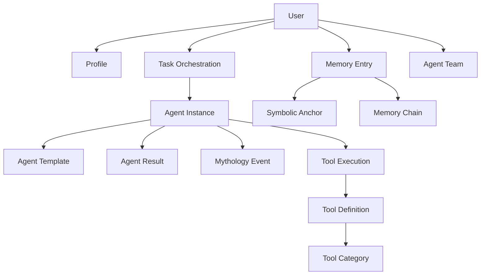

# Donkey Betz Architecture Documentation Report

## Executive Summary

Donkey Betz is a sophisticated AI-powered business intelligence platform built on Django, featuring a multi-layered architecture that integrates 21+ specialized AI agents, real-time data processing, and advanced learning systems. The platform transforms exercise into productive work time through innovative AI orchestration.

## Table of Contents

1. [System Overview](#system-overview)
2. [Core Architecture](#core-architecture)
3. [Major Systems](#major-systems)
4. [Database Schema](#database-schema)
5. [Integration Points](#integration-points)
6. [Data Flow](#data-flow)
7. [Technology Stack](#technology-stack)
8. [Security & Privacy](#security--privacy)

## System Overview

### Platform Vision
Donkey Betz combines physical activity with business intelligence, allowing users to build business empires while building physical health. The system leverages multiple AI providers, real-time data streams, and intelligent memory systems.

### Key Features
- **21+ Specialized AI Agents**: From business strategy to security validation
- **Real-Time Stock Intelligence**: Powered by Polygon.io with WebSocket streaming
- **Content Creation Studio**: DALL-E 3 and Stable Diffusion integration
- **Memory Palace**: Personal AI with RAG retrieval and semantic search
- **Universal Builder**: Dynamic business code generation
- **Research Intelligence**: Unified search across APIs and personal memory

## Core Architecture

### 1. Django Backend Structure

The backend follows a modular Django architecture with these key apps:

```
backend/
├── server/                 # Core Django settings and configuration
│   ├── settings.py        # Main settings with multi-environment support
│   ├── urls.py            # URL routing configuration
│   ├── asgi.py            # ASGI for WebSocket support
│   └── wsgi.py            # WSGI for HTTP requests
│
├── core/                  # Core models and utilities
│   ├── models.py          # User profiles, workouts, goals
│   ├── models_chat.py     # Real-time chat functionality
│   ├── models_analytics.py # Usage tracking and analytics
│   └── models_notifications.py # Push notification system
│
├── agent_orchestra/       # AI Agent Orchestration System
│   ├── models.py          # AgentTemplate, TaskOrchestration, AgentInstance
│   ├── agent_factory.py   # Dynamic agent creation
│   ├── consumers/         # WebSocket consumers for real-time updates
│   └── celery_tasks.py    # Background task processing
│
├── memory/                # Memory Palace System
│   ├── models.py          # MemoryEntry, MemoryChain, SymbolicAnchor
│   ├── views_memory_palace.py # API endpoints
│   └── services/          # Memory search and retrieval
│
├── ai_partner/            # Personal AI Assistant
│   ├── models.py          # ConversationMemory, UserLifeProfile
│   ├── services/          # AI conversation handling
│   └── memory_services/   # Enhanced memory integration
│
├── learning_intelligence/ # Self-Improving AI System
│   ├── models.py          # SymbolicMemoryAnchor, LearningSession
│   └── services/          # Learning algorithms
│
├── mythology_lab/         # AI Mythology Tracking
│   ├── models.py          # MythologyEvent, MythPropagation
│   └── services/          # Mythology detection and prevention
│
├── prompting_system/      # Unified Prompt Management
│   ├── models.py          # PromptTemplate, PromptComponent
│   └── services/          # Dynamic prompt composition
│
├── tool_orchestra/        # Tool & API Management
│   ├── models.py          # ToolDefinition, ToolExecution
│   └── services/          # API gateway and tool routing
│
├── universal_builder/     # Business Code Generation
│   ├── models.py          # GeneratedBusiness, BuilderTemplate
│   └── services/          # Code generation engine
│
├── knowledge_base/        # Entity Recognition System
│   ├── models.py          # UserEntityRegistry, EntityRelationship
│   └── context_middleware.py # Context injection
│
├── security/              # Privacy & Security Framework
│   ├── models.py          # Privacy controls
│   └── middleware.py      # Security headers, rate limiting
│
└── shared_memory/         # Unified Memory System
    ├── models.py          # UnifiedMemoryEntry
    └── services/          # Deduplication service
```

### 2. Multi-LLM Architecture

The system supports multiple LLM providers with intelligent failover:

```python
LLM_PROVIDERS = {
    'openai': {
        'api_key': OPENAI_API_KEY,
        'models': ['gpt-4', 'gpt-3.5-turbo'],
        'max_retries': 2,
    },
    'anthropic': {
        'api_key': ANTHROPIC_API_KEY,
        'models': ['claude-3-opus', 'claude-3-sonnet'],
    },
    'google': {
        'api_key': GOOGLE_API_KEY,
        'models': ['gemini-pro'],
    },
    'ollama': {
        'base_url': 'http://localhost:11434',
        'models': ['llama2', 'mistral'],
    }
}
```

### 3. WebSocket Architecture

Real-time features powered by Django Channels:

- **Agent Progress Updates**: Live tracking of agent execution
- **Stock Price Streaming**: Real-time market data via Polygon.io
- **Chat & Collaboration**: Instant messaging between users and agents
- **Reddit Scout Updates**: Live discovery of startup ideas

## Major Systems

### 1. Agent Orchestra System

The heart of Donkey Betz - manages 21+ specialized agents working collaboratively.

**Key Components:**
- **AgentTemplate**: Base templates for agent types (Technical, Business, Marketing, etc.)
- **TaskOrchestration**: Manages complex multi-agent workflows
- **AgentInstance**: Active agents working on specific tasks
- **AgentTeam**: Multi-LLM teams for heterogeneous AI collaboration

**Agent Specializations:**
```python
SPECIALIZATIONS = [
    ('research', 'Research & Analysis'),
    ('content', 'Content Creation'),
    ('business', 'Business Development'),
    ('career', 'Career Development'),
    ('technical', 'Technical Analysis'),
    ('creative', 'Creative Design'),
    ('marketing', 'Marketing & Growth'),
    ('financial', 'Financial Analysis'),
    ('legal', 'Legal & Compliance'),
    ('communication', 'Communication & Outreach'),
]
```

### 2. Memory Palace System

Advanced personal memory system with semantic search and RAG retrieval.

**Features:**
- **Vector Embeddings**: Using pgvector for similarity search
- **Reality Engine**: Distinguishes human facts from AI-generated content
- **Symbolic Anchors**: Concepts that persist across conversations
- **Memory Chains**: Related memories forming narratives

**Memory Types:**
```python
SOURCE_TYPES = [
    ('human_provided', 'Human Provided'),
    ('ai_generated', 'AI Generated'),
    ('system_import', 'System Import'),
    ('markdown_ingestion', 'Markdown Ingestion'),
    ('verified_fact', 'Verified Fact')
]
```

### 3. Learning Intelligence System

Self-improving AI through symbolic memory anchors and performance tracking.

**Learning Stages:**
```python
ACQUISITION_STAGES = [
    ('unseen', 'Unseen'),
    ('exposed', 'Exposed'),
    ('acquired', 'Acquired'),
    ('reinforced', 'Reinforced'),
]
```

**Key Metrics:**
- Usage count and success rate
- Mutation tracking and evolution
- Quality scores and stability indicators
- Cross-model learning capabilities

### 4. Tool Orchestra System

Unified gateway for all external APIs and tools.

**Tool Categories:**
- AI Generation (OpenAI, Stable Diffusion, etc.)
- Financial Data (Polygon, Alpha Vantage, etc.)
- Search & Discovery (Serper, Reddit, etc.)
- Communication (Twilio, Email, Telegram)
- Analytics (DataDog, Prometheus)

**Execution Tracking:**
- Rate limiting per API
- Cost tracking and quotas
- Fallback chains for reliability
- Performance analytics

### 5. Mythology Lab

Tracks and prevents AI hallucinations and "mythology" creation.

**Mythology Types:**
```python
MUTATION_TYPES = [
    ('context_loss', 'Context Loss'),
    ('inflation', 'Numeric Inflation'),
    ('semantic_drift', 'Semantic Drift'),
    ('confidence_decay', 'Confidence Decay'),
    ('expansion', 'Content Expansion'),
    ('condensation', 'Content Condensation'),
]
```

### 6. Universal Builder

Dynamic business code generation system.

**Capabilities:**
- Full-stack application generation
- Business plan creation
- API endpoint scaffolding
- Database schema design
- Deployment configurations

## Database Schema

### Core Relationships



### Key Models

1. **User & Profile**
   - Extended Django User model
   - Profile with display name, bio, mood tracking
   - LLM preferences per use case

2. **Agent Orchestra Models**
   - AgentTemplate: Reusable agent configurations
   - TaskOrchestration: Multi-agent task coordination
   - AgentInstance: Active agent executions
   - AgentTeam: Multi-LLM collaborative teams

3. **Memory Models**
   - MemoryEntry: Core memory storage with embeddings
   - SymbolicMemoryAnchor: Persistent concepts
   - ReflectionLog: AI self-reflection tracking

4. **Execution Models**
   - ToolExecution: API call tracking
   - PromptExecution: Prompt usage analytics
   - CrossModelInteraction: Multi-LLM communication

## Integration Points

### 1. Memory Palace ↔ Agent Orchestra
- Agents access user memories for context
- Agent results saved to Memory Palace
- Symbolic anchors guide agent behavior

### 2. Learning Intelligence ↔ All Systems
- Tracks performance across all components
- Adapts prompts based on success patterns
- Evolves agent capabilities over time

### 3. Tool Orchestra ↔ External APIs
- Centralized API key management
- Unified error handling and retries
- Cost tracking across all services

### 4. Mythology Lab ↔ Response Validation
- Real-time hallucination detection
- Response correction before delivery
- Pattern tracking for prevention

### 5. Knowledge Base ↔ Context Injection
- Entity facts injected into prompts
- Prevents AI confusion about identities
- Maintains consistency across conversations

## Data Flow

### 1. User Request Flow
```
User Request → API Endpoint → Authentication
    ↓
Context Injection (Knowledge Base)
    ↓
Task Analysis (Agent Orchestra)
    ↓
Agent Assignment & Execution
    ↓
Tool Orchestra (External APIs)
    ↓
Memory Retrieval (Memory Palace)
    ↓
Response Generation
    ↓
Mythology Detection & Correction
    ↓
Response Delivery → User
```

### 2. Memory Flow
```
User Input → Embedding Generation
    ↓
Memory Storage (with source attribution)
    ↓
Symbolic Anchor Analysis
    ↓
Learning Intelligence Update
    ↓
Future Retrieval Optimization
```

### 3. Real-Time Flow
```
WebSocket Connection → JWT Authentication
    ↓
Channel Layer (Redis)
    ↓
Consumer Handler
    ↓
Real-time Updates → Client
```

## Technology Stack

### Backend
- **Framework**: Django 5.2+ with Django REST Framework
- **Async**: Django Channels for WebSockets
- **Task Queue**: Celery with Redis broker
- **Database**: PostgreSQL with pgvector extension
- **Cache**: Redis (multiple databases for different purposes)
- **Search**: pgvector for semantic search

### AI/ML
- **Embeddings**: OpenAI text-embedding-3-small
- **LLMs**: Multi-provider (OpenAI, Anthropic, Google, Ollama)
- **Vector DB**: pgvector for similarity search
- **ML Models**: Custom PyTorch models for specific tasks

### Infrastructure
- **Container**: Docker with docker-compose
- **Monitoring**: Prometheus + Django-prometheus
- **API Docs**: drf-spectacular (OpenAPI/Swagger)
- **Storage**: Local + S3-compatible storage

### Security
- **Authentication**: JWT tokens (djangorestframework-simplejwt)
- **Encryption**: Field-level encryption for sensitive data
- **Rate Limiting**: Django-ratelimit + custom middleware
- **Privacy**: GDPR/CCPA compliance features

## Security & Privacy

### 1. Authentication & Authorization
- JWT-based authentication with refresh tokens
- Role-based access control
- API key management for external services

### 2. Data Protection
- Field-level encryption for sensitive data
- PII detection and anonymization
- Audit logging for compliance

### 3. Rate Limiting
```python
DEFAULT_THROTTLE_RATES = {
    "anon": "20/min",
    "user": "200/min",
    "stocks": "300/min",
    "batch": "60/min",
}
```

### 4. Privacy Features
- Data export capabilities
- Right to deletion
- Anonymization options
- Privacy preference management

## Performance Optimizations

### 1. Database
- Connection pooling with PgBouncer
- Read replicas for heavy queries
- Optimized indexes for common queries
- Batch processing for embeddings

### 2. Caching Strategy
- Redis caching with multiple databases:
  - Default cache (1 hour)
  - Memory search cache (1 hour)
  - Embedding cache (2 hours)
  - API response cache (5 minutes)
  - Orchestration cache (30 minutes)

### 3. Async Processing
- Celery for background tasks
- Django Channels for real-time features
- Async views for I/O-bound operations

## Conclusion

Donkey Betz represents a sophisticated integration of multiple AI systems, real-time data processing, and intelligent memory management. The modular architecture allows for independent scaling of components while maintaining tight integration where needed. The platform's unique approach to combining physical activity with business intelligence is supported by a robust technical foundation that prioritizes reliability, performance, and user privacy.

The system's ability to learn and improve through the Learning Intelligence framework, combined with mythology prevention and multi-LLM support, positions it as a cutting-edge AI platform ready for enterprise deployment.