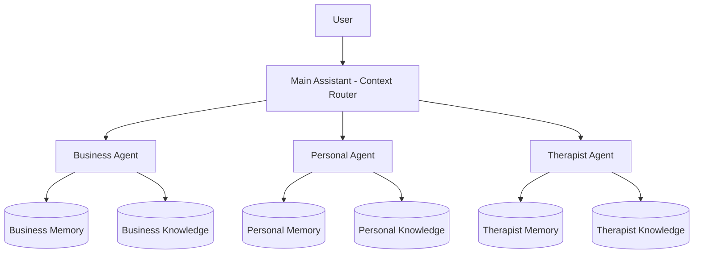

# Donkey Betz Context-Based AI OS Architecture Analysis
Generated: 2025-07-18 16:30:17

## Executive Summary

This document outlines the transformation of Donkey Betz from an agent orchestration system into a context-aware AI Operating System. The key innovation is implementing hard privacy boundaries through context-specific agents, preventing cross-contamination between personal, business, and other life contexts.

## Current System Analysis

### Architecture Overview
- **Hierarchy**: User → Main Assistant → Agent Orchestra → Teams → Scouts → Tasks
- **Components**: 1,882 behavioral components
- **Knowledge Base**: 2,208 documents with embeddings
- **Memory Entries**: 18,176 (most lacking embeddings)

### Key Systems
1. **Memory Palace**: Dual embedding patterns (relationship-based vs direct field)
2. **Mythology Lab**: Hallucination prevention with pre-generation guards
3. **AI Profile Intelligents**: Bidirectional learning system (complete)
4. **Cross-Domain Adapter**: 390 examples → 1,560+ adaptations

## Proposed Context-Based Architecture

### Context Design

#### Business Context
- **Purpose**: Professional and work-related activities
- **Memory Namespace**: `business_memory`
- **Knowledge Domains**: work, projects, clients, meetings
- **Agent Capabilities**: scheduling, analysis, reporting, collaboration

#### Personal Context
- **Purpose**: Personal life and activities
- **Memory Namespace**: `personal_memory`
- **Knowledge Domains**: family, friends, hobbies, personal_goals
- **Agent Capabilities**: reminders, planning, journaling, learning

#### Therapist Context
- **Purpose**: Mental health and wellness
- **Memory Namespace**: `therapist_memory`
- **Knowledge Domains**: emotions, patterns, coping, growth
- **Agent Capabilities**: reflection, analysis, support, tracking
- **Special Consideration**: Enhanced privacy protections

### Architectural Changes



## Required Modifications

### Memory Palace
**Current State**: Dual embedding patterns causing 500 error

**Required Changes**:
- Add context_namespace field to all memory models
- Implement context-based query filtering
- Create separate embedding spaces per context
- Add memory transfer/deletion capabilities

### Ai Profile Intelligents
**Current State**: Bidirectional learning system complete

**Required Changes**:
- Add context boundaries to learning flows
- Implement context-specific agent profiles
- Add cross-context learning permissions

### Mythology Lab
**Current State**: Hallucination prevention system

**Required Changes**:
- Add cross-context contamination detection
- Implement context breach alerts
- Track inter-context information leakage

### Knowledge Base
**Current State**: 2,208 documents with embeddings

**Required Changes**:
- Tag all documents with context metadata
- Implement context-based access control
- Create document migration tool

## New Components

### ContextManager
- **Location**: `backend/context_manager/`
- **Purpose**: Manage context switching and routing
- **Key Features**:
  - Context authentication
  - Session management
  - Context switching UI backend
  - Cross-context permission system

### MemoryTransferService
- **Location**: `backend/memory/transfer_service.py`
- **Purpose**: Handle memory operations across contexts
- **Key Features**:
  - Memory deletion with confirmation
  - Memory transfer between contexts
  - Memory sanitization (remove PII)
  - Bulk operations support

### ContextAuditLogger
- **Location**: `backend/audit/context_logger.py`
- **Purpose**: Track all cross-context activities
- **Key Features**:
  - Log context switches
  - Track cross-context requests
  - Monitor data access patterns
  - Generate privacy reports

### ContextRouter
- **Location**: `frontend/src/features/context-router/`
- **Purpose**: Frontend context switching interface
- **Key Features**:
  - Visual context switcher
  - Current context indicator
  - Context-specific UI themes
  - Quick switch shortcuts

## Migration Plan

### Phase 1: Foundation (1-2 weeks)
**Tasks**:
- [ ] Fix Memory Palace 500 error
- [ ] Create ContextManager base implementation
- [ ] Add context_namespace to memory models
- [ ] Create context configuration system

**Deliverables**:
- Working Memory Palace
- Basic context switching
- Context-aware data models

### Phase 2: Data Segregation (2-3 weeks)
**Tasks**:
- [ ] Implement context-based query filtering
- [ ] Create separate embedding spaces
- [ ] Build document tagging system
- [ ] Develop memory transfer service

**Deliverables**:
- Isolated data per context
- Document classification tool
- Memory management UI

### Phase 3: Agent Adaptation (2-3 weeks)
**Tasks**:
- [ ] Modify AI Profile Intelligents for contexts
- [ ] Update Agent Orchestra for multi-instance
- [ ] Implement context-specific learning
- [ ] Extend Mythology Lab for cross-context detection

**Deliverables**:
- Context-aware agents
- Isolated learning systems
- Cross-context safeguards

### Phase 4: UI and Polish (1-2 weeks)
**Tasks**:
- [ ] Build context switching UI
- [ ] Create audit dashboard
- [ ] Implement keyboard shortcuts
- [ ] Add context indicators throughout UI

**Deliverables**:
- Polished context switching
- Privacy dashboard
- User documentation

## Implementation Priorities

### Immediate Actions (Week 1)
1. Fix Memory Palace 500 error
2. Design context namespace schema
3. Create ContextManager skeleton
4. Begin document classification

### Critical Path Items
1. Memory segregation infrastructure
2. Context switching mechanism
3. Data migration tools
4. Privacy audit system

### Performance Considerations
- Lazy loading of context-specific data
- Cached context switching
- Efficient embedding space separation
- Optimized cross-context permission checks

## Code Examples

### Context Namespace Implementation
```python
class ContextAwareMemory(models.Model):
    context_namespace = models.CharField(max_length=50, db_index=True)
    user = models.ForeignKey(User, on_delete=models.CASCADE)
    content = models.JSONField()
    
    class Meta:
        indexes = [
            models.Index(fields=['user', 'context_namespace']),
        ]
```

### Context Router Example
```python
class ContextRouter:
    def __init__(self, user):
        self.user = user
        self.current_context = None
        
    def switch_context(self, context_name: str):
        # Validate context
        if context_name not in self.get_available_contexts():
            raise ValueError(f"Invalid context: {context_name}")
            
        # Log context switch
        ContextAuditLogger.log_switch(
            user=self.user,
            from_context=self.current_context,
            to_context=context_name
        )
        
        # Switch context
        self.current_context = context_name
        return self.get_context_agent(context_name)
```

## Risk Mitigation

### Data Privacy Risks
- **Risk**: Cross-context data leakage
- **Mitigation**: Hard boundaries, encryption, audit logging

### Performance Risks
- **Risk**: Overhead from context checks
- **Mitigation**: Caching, indexed queries, lazy loading

### User Experience Risks
- **Risk**: Complex context switching
- **Mitigation**: Intuitive UI, keyboard shortcuts, visual indicators

## Success Metrics

1. **Privacy**: Zero cross-context data leaks
2. **Performance**: <100ms context switch time
3. **Usability**: <3 clicks to any context operation
4. **Adoption**: 90% of operations within correct context

## Next Steps

1. Review and approve this architecture
2. Set up development branches for each phase
3. Create detailed technical specifications
4. Begin Phase 1 implementation
5. Establish testing protocols

---

*This document serves as the blueprint for transforming Donkey Betz into a privacy-first, context-aware AI Operating System.*
