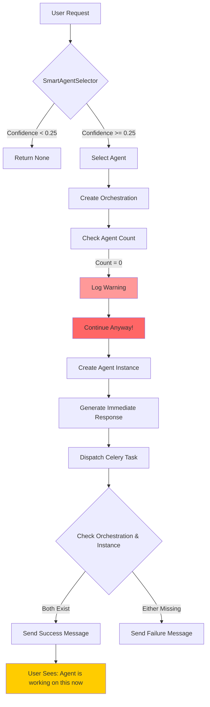
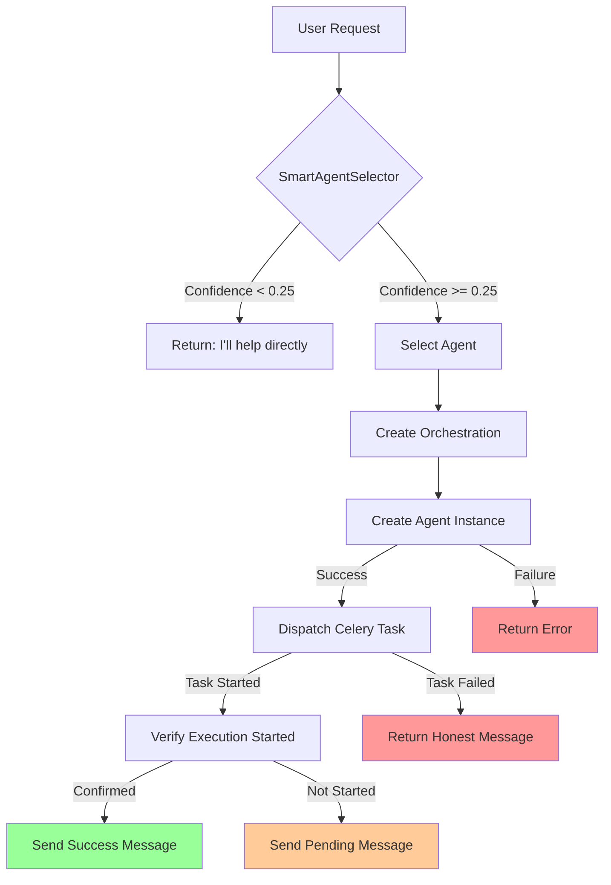

# Agent Deployment Flow Diagram

## Current Flow (WITH BUG)

## Key Decision Points

1. **Confidence Calculation** (SmartAgentSelector)
   - Keywords match: +1 point per keyword
   - Phrases match: +2 points per phrase
   - Score normalized: `confidence = min(score / 5, 1.0)`
   - Threshold: 0.25

2. **Agent Count Check** (Line 1544-1557)
   - **BUG**: Checks BEFORE instance is created
   - Always returns 0
   - Logs warning but doesn't stop

3. **Instance Creation** (Line 1647)
   - Happens AFTER the check
   - Always succeeds if orchestration exists

4. **Final Verification** (Line 1816)
   - Checks if orchestration AND instance exist
   - Since instance was created, this passes
   - Sends success message

## Correct Flow (AFTER FIX)

## Critical Issues Identified

1. **Verification Timing**: Check happens before instance creation
2. **Error Handling**: Warnings don't stop execution
3. **False Success**: Success claimed before verifying execution
4. **Task Truncation**: User input is being mangled

## Recommended Fixes

1. **Immediate**: Move verification after instance creation
2. **Better**: Verify Celery task started before claiming success
3. **Best**: Implement proper state machine with checkpoints