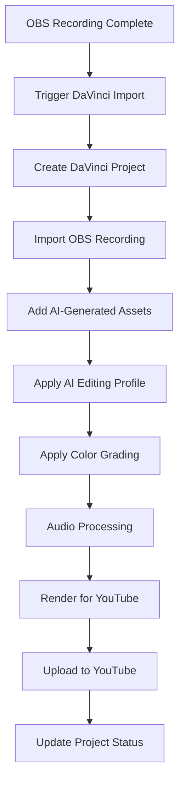

# DaVinci Resolve Integration with AI Content Studio Pipeline

## Overview

This document outlines the comprehensive integration of DaVinci Resolve with the existing AI Content Studio pipeline, connecting OBS Studio recordings, AI-generated content, and YouTube publishing into a seamless professional video production workflow.

## Current Pipeline Status

### Existing Components (Session 40 - Fully Implemented)
- ✅ **OBS Studio Integration**: Complete WebSocket control with recording management
- ✅ **AI Content Studio**: Image generation (DALL-E 3, Stable Diffusion), video generation (Runway Gen-4 Turbo)
- ✅ **YouTube Studio**: Complete OAuth2 integration with upload, metadata, and playlist management
- ✅ **Unified Dashboard**: Real-time status monitoring and control interface

### Integration Opportunity
DaVinci Resolve represents the missing professional post-production link between raw content creation and final publishing, enabling:
- Advanced color grading and correction
- Professional audio mixing and enhancement
- Complex visual effects and compositing
- Automated editing workflows powered by AI

## DaVinci Resolve API Capabilities

### Core API Features
- **Python Integration**: Full Python 3.10+ support with comprehensive scripting API
- **Project Management**: Create, open, and manage projects programmatically
- **Timeline Control**: Add media, create sequences, manage clips and markers
- **Color Grading**: Access to color wheels, curves, and grading tools (limited)
- **Audio Processing**: Basic audio operations and Fairlight integration
- **Render Engine**: Export control with format, codec, and quality settings
- **Fusion Compositing**: Node-based visual effects through Python API

### API Limitations
- Cannot directly edit clips (auto-trim/split based on markers)
- Limited access to raw frame data in Color/Delivery stages
- No direct access to audio channel settings
- Requires DaVinci Resolve Studio for external script execution

## Architecture Design

### 1. Service Layer Architecture

```
┌─────────────────┐    ┌─────────────────┐    ┌─────────────────┐
│   OBS Studio    │    │  AI Content     │    │  DaVinci        │
│   Recording     │────│   Generation    │────│   Resolve       │
│                 │    │                 │    │   Processing    │
└─────────────────┘    └─────────────────┘    └─────────────────┘
         │                       │                       │
         │                       │                       │
         ▼                       ▼                       ▼
┌─────────────────┐    ┌─────────────────┐    ┌─────────────────┐
│   File System   │    │   Media Pool    │    │   YouTube       │
│   Storage       │◄───│   Management    │────│   Publishing    │
│                 │    │                 │    │                 │
└─────────────────┘    └─────────────────┘    └─────────────────┘
```

### 2. Database Schema Extensions

```python
# New models for DaVinci Resolve integration

class DaVinciProject(models.Model):
    user = models.ForeignKey(User, on_delete=models.CASCADE)
    name = models.CharField(max_length=200)
    project_path = models.CharField(max_length=500)
    resolve_project_id = models.CharField(max_length=100, unique=True)
    
    # Source content tracking
    obs_recording = models.ForeignKey('obs_studio.Recording', null=True, blank=True, on_delete=models.CASCADE)
    ai_content_assets = models.ManyToManyField('content_studio.GeneratedAsset', blank=True)
    
    # Processing status
    status = models.CharField(max_length=20, choices=[
        ('created', 'Created'),
        ('importing', 'Importing Media'),
        ('editing', 'In Edit'),
        ('color_grading', 'Color Grading'),
        ('audio_mixing', 'Audio Mixing'),
        ('rendering', 'Rendering'),
        ('completed', 'Completed'),
        ('failed', 'Failed')
    ], default='created')
    
    # Metadata
    resolution = models.CharField(max_length=20, default='1920x1080')
    frame_rate = models.FloatField(default=30.0)
    created_at = models.DateTimeField(auto_now_add=True)
    updated_at = models.DateTimeField(auto_now=True)

class DaVinciTimeline(models.Model):
    project = models.ForeignKey(DaVinciProject, on_delete=models.CASCADE, related_name='timelines')
    name = models.CharField(max_length=200)
    resolve_timeline_id = models.CharField(max_length=100)
    duration_frames = models.IntegerField(default=0)
    
    # AI-driven configurations
    editing_profile = models.CharField(max_length=50, choices=[
        ('minimal', 'Minimal Editing'),
        ('standard', 'Standard Cuts'),
        ('dynamic', 'Dynamic Editing'),
        ('cinematic', 'Cinematic Style')
    ], default='standard')
    
    color_profile = models.CharField(max_length=50, choices=[
        ('natural', 'Natural Color'),
        ('vibrant', 'Vibrant Enhancement'),
        ('cinematic', 'Cinematic Look'),
        ('custom', 'Custom Profile')
    ], default='natural')

class DaVinciRenderJob(models.Model):
    timeline = models.ForeignKey(DaVinciTimeline, on_delete=models.CASCADE)
    render_preset = models.CharField(max_length=100)
    output_path = models.CharField(max_length=500)
    
    # YouTube integration
    youtube_upload_config = models.JSONField(null=True, blank=True)
    
    # Status tracking
    status = models.CharField(max_length=20, choices=[
        ('queued', 'Queued'),
        ('rendering', 'Rendering'),
        ('completed', 'Completed'),
        ('failed', 'Failed')
    ], default='queued')
    
    progress_percentage = models.FloatField(default=0.0)
    started_at = models.DateTimeField(null=True, blank=True)
    completed_at = models.DateTimeField(null=True, blank=True)
```

### 3. Service Implementation

#### DaVinci Resolve Service
```python
# backend/content/services/davinci_resolve_service.py

import os
import sys
import time
import logging
from typing import Dict, List, Any, Optional, Tuple
from django.conf import settings
from django.utils import timezone

# DaVinci Resolve API setup
RESOLVE_SCRIPT_API = getattr(settings, 'RESOLVE_SCRIPT_API', '/Library/Application Support/Blackmagic Design/DaVinci Resolve/Developer/Scripting')
RESOLVE_SCRIPT_LIB = getattr(settings, 'RESOLVE_SCRIPT_LIB', '/Applications/DaVinci Resolve/DaVinci Resolve.app/Contents/Libraries/Fusion/fusionscript.so')

sys.path.append(f"{RESOLVE_SCRIPT_API}/Modules/")

try:
    import DaVinciResolveScript as dvr_script
    RESOLVE_AVAILABLE = True
except ImportError:
    RESOLVE_AVAILABLE = False
    logging.warning("DaVinci Resolve API not available")

logger = logging.getLogger(__name__)

class DaVinciResolveService:
    """Service for DaVinci Resolve integration and automation"""
    
    def __init__(self):
        self.resolve = None
        self.project_manager = None
        self.current_project = None
        self.fusion = None
        
    def connect(self) -> bool:
        """Connect to DaVinci Resolve instance"""
        if not RESOLVE_AVAILABLE:
            logger.error("DaVinci Resolve API not available")
            return False
            
        try:
            self.resolve = dvr_script.scriptapp("Resolve")
            if not self.resolve:
                logger.error("Could not connect to DaVinci Resolve")
                return False
                
            self.project_manager = self.resolve.GetProjectManager()
            self.fusion = self.resolve.Fusion()
            
            logger.info("Successfully connected to DaVinci Resolve")
            return True
            
        except Exception as e:
            logger.error(f"Failed to connect to DaVinci Resolve: {e}")
            return False
    
    def create_project(self, project_name: str, settings: Dict[str, Any] = None) -> Optional[str]:
        """Create a new DaVinci Resolve project"""
        if not self.project_manager:
            if not self.connect():
                return None
        
        try:
            # Create project
            project = self.project_manager.CreateProject(project_name)
            if not project:
                logger.error(f"Failed to create project: {project_name}")
                return None
            
            self.current_project = project
            
            # Apply project settings
            if settings:
                self._apply_project_settings(settings)
            
            # Get project ID
            project_id = project.GetUniqueId()
            logger.info(f"Created DaVinci Resolve project: {project_name} (ID: {project_id})")
            
            return project_id
            
        except Exception as e:
            logger.error(f"Error creating project: {e}")
            return None
    
    def _apply_project_settings(self, settings: Dict[str, Any]):
        """Apply project settings like resolution, frame rate, color space"""
        try:
            # Timeline settings
            timeline_settings = {
                "timelineResolutionWidth": settings.get('width', 1920),
                "timelineResolutionHeight": settings.get('height', 1080),
                "timelineFrameRate": str(settings.get('frame_rate', 30))
            }
            
            # Color settings
            if settings.get('color_space'):
                timeline_settings["colorSpaceTimeline"] = settings['color_space']
            
            # Apply settings
            self.current_project.SetSetting(**timeline_settings)
            
        except Exception as e:
            logger.error(f"Error applying project settings: {e}")
    
    def import_media(self, media_paths: List[str], media_pool_folder: str = "Imported Media") -> bool:
        """Import media files into the current project"""
        if not self.current_project:
            logger.error("No active project for media import")
            return False
        
        try:
            media_pool = self.current_project.GetMediaPool()
            
            # Create folder if specified
            if media_pool_folder != "Master":
                folder = media_pool.AddSubFolder(media_pool.GetRootFolder(), media_pool_folder)
                media_pool.SetCurrentFolder(folder)
            
            # Import media files
            imported_clips = media_pool.ImportMedia(media_paths)
            
            if imported_clips:
                logger.info(f"Successfully imported {len(imported_clips)} media files")
                return True
            else:
                logger.warning("No media files were imported")
                return False
                
        except Exception as e:
            logger.error(f"Error importing media: {e}")
            return False
    
    def create_timeline(self, timeline_name: str, clips: List[str] = None) -> Optional[str]:
        """Create a new timeline and optionally add clips"""
        if not self.current_project:
            logger.error("No active project for timeline creation")
            return None
        
        try:
            media_pool = self.current_project.GetMediaPool()
            
            # Create timeline
            if clips:
                # Get clips from media pool
                media_pool_clips = []
                for clip_name in clips:
                    clip = media_pool.GetClipByName(clip_name)
                    if clip:
                        media_pool_clips.append(clip)
                
                timeline = media_pool.CreateTimelineFromClips(timeline_name, media_pool_clips)
            else:
                timeline = media_pool.CreateEmptyTimeline(timeline_name)
            
            if timeline:
                timeline_id = timeline.GetUniqueId()
                logger.info(f"Created timeline: {timeline_name} (ID: {timeline_id})")
                return timeline_id
            else:
                logger.error(f"Failed to create timeline: {timeline_name}")
                return None
                
        except Exception as e:
            logger.error(f"Error creating timeline: {e}")
            return None
    
    def apply_ai_editing_profile(self, timeline_id: str, profile: str) -> bool:
        """Apply AI-driven editing profiles to timeline"""
        timeline = self._get_timeline_by_id(timeline_id)
        if not timeline:
            return False
        
        try:
            if profile == "minimal":
                # Minimal cuts, longer shots
                self._apply_minimal_editing(timeline)
            elif profile == "standard":
                # Standard pacing with natural cuts
                self._apply_standard_editing(timeline)
            elif profile == "dynamic":
                # Fast cuts, dynamic pacing
                self._apply_dynamic_editing(timeline)
            elif profile == "cinematic":
                # Cinematic pacing with artistic cuts
                self._apply_cinematic_editing(timeline)
                
            return True
            
        except Exception as e:
            logger.error(f"Error applying editing profile: {e}")
            return False
    
    def apply_color_profile(self, timeline_id: str, profile: str) -> bool:
        """Apply color grading profiles"""
        timeline = self._get_timeline_by_id(timeline_id)
        if not timeline:
            return False
        
        try:
            # Switch to Color page
            self.resolve.OpenPage("color")
            
            clips = timeline.GetItemListInTrack("video", 1)
            
            for clip in clips:
                timeline.SetCurrentVideoItem(clip)
                
                if profile == "natural":
                    self._apply_natural_color(clip)
                elif profile == "vibrant":
                    self._apply_vibrant_color(clip)
                elif profile == "cinematic":
                    self._apply_cinematic_color(clip)
                    
            return True
            
        except Exception as e:
            logger.error(f"Error applying color profile: {e}")
            return False
    
    def render_timeline(self, timeline_id: str, render_settings: Dict[str, Any]) -> Optional[str]:
        """Render timeline with specified settings"""
        timeline = self._get_timeline_by_id(timeline_id)
        if not timeline:
            return None
        
        try:
            # Switch to Deliver page
            self.resolve.OpenPage("deliver")
            
            # Set current timeline
            self.current_project.SetCurrentTimeline(timeline)
            
            # Configure render settings
            render_job_id = self.current_project.AddRenderJob()
            
            # Apply render settings
            render_settings_formatted = {
                "SelectAllFrames": True,
                "MarkIn": render_settings.get('mark_in', 0),
                "MarkOut": render_settings.get('mark_out', timeline.GetEndFrame()),
                "TargetDir": render_settings.get('output_dir', '/tmp/davinci_render'),
                "CustomName": render_settings.get('output_name', 'rendered_video'),
                "FormatWidth": render_settings.get('width', 1920),
                "FormatHeight": render_settings.get('height', 1080),
                "FrameRate": render_settings.get('frame_rate', 30)
            }
            
            self.current_project.SetRenderSettings(render_settings_formatted)
            
            # Start render
            self.current_project.StartRendering(render_job_id)
            
            logger.info(f"Started render job: {render_job_id}")
            return render_job_id
            
        except Exception as e:
            logger.error(f"Error starting render: {e}")
            return None
    
    def get_render_status(self, job_id: str) -> Dict[str, Any]:
        """Get render job status and progress"""
        try:
            jobs = self.current_project.GetRenderJobList()
            
            for job in jobs:
                if job.get('JobId') == job_id:
                    return {
                        'status': job.get('JobStatus', 'Unknown'),
                        'progress': job.get('CompletionPercentage', 0),
                        'time_remaining': job.get('EstimatedTimeRemainingInSeconds', 0)
                    }
            
            return {'status': 'NotFound', 'progress': 0}
            
        except Exception as e:
            logger.error(f"Error getting render status: {e}")
            return {'status': 'Error', 'progress': 0}
    
    def _get_timeline_by_id(self, timeline_id: str):
        """Get timeline object by ID"""
        try:
            timelines = self.current_project.GetTimelineCount()
            for i in range(1, timelines + 1):
                timeline = self.current_project.GetTimelineByIndex(i)
                if timeline.GetUniqueId() == timeline_id:
                    return timeline
            return None
        except Exception as e:
            logger.error(f"Error finding timeline: {e}")
            return None
    
    # AI-driven editing methods
    def _apply_minimal_editing(self, timeline):
        """Apply minimal editing - longer shots, fewer cuts"""
        # Implementation for minimal editing
        pass
    
    def _apply_standard_editing(self, timeline):
        """Apply standard editing pacing"""
        # Implementation for standard editing
        pass
    
    def _apply_dynamic_editing(self, timeline):
        """Apply dynamic editing - faster cuts"""
        # Implementation for dynamic editing
        pass
    
    def _apply_cinematic_editing(self, timeline):
        """Apply cinematic editing style"""
        # Implementation for cinematic editing
        pass
    
    # Color grading methods
    def _apply_natural_color(self, clip):
        """Apply natural color grading"""
        # Implementation for natural color
        pass
    
    def _apply_vibrant_color(self, clip):
        """Apply vibrant color enhancement"""
        # Implementation for vibrant color
        pass
    
    def _apply_cinematic_color(self, clip):
        """Apply cinematic color look"""
        # Implementation for cinematic color
        pass
```

## Integration Workflow

### 1. OBS → DaVinci → YouTube Pipeline



### 2. AI Content Studio Integration

```python
# Enhanced video generation with DaVinci integration
class EnhancedVideoGenerationService:
    def __init__(self):
        self.runway_service = RunwayAPIService()
        self.davinci_service = DaVinciResolveService()
        self.youtube_service = YouTubeUploadService()
    
    async def create_professional_video(self, content_request: Dict[str, Any]) -> Dict[str, Any]:
        """Create professional video with DaVinci post-processing"""
        
        # 1. Generate base content with AI
        ai_assets = await self._generate_ai_content(content_request)
        
        # 2. Create DaVinci project
        project_id = self.davinci_service.create_project(
            f"AI_Video_{int(time.time())}",
            settings={
                'width': 1920,
                'height': 1080,
                'frame_rate': 30,
                'color_space': 'Rec.709'
            }
        )
        
        # 3. Import AI-generated assets
        media_paths = [asset['file_path'] for asset in ai_assets]
        self.davinci_service.import_media(media_paths)
        
        # 4. Create timeline with AI editing
        timeline_id = self.davinci_service.create_timeline(
            "Main_Timeline",
            clips=[asset['name'] for asset in ai_assets]
        )
        
        # 5. Apply AI-driven post-processing
        editing_profile = content_request.get('editing_style', 'standard')
        self.davinci_service.apply_ai_editing_profile(timeline_id, editing_profile)
        
        color_profile = content_request.get('color_style', 'natural')
        self.davinci_service.apply_color_profile(timeline_id, color_profile)
        
        # 6. Render for YouTube
        render_settings = {
            'output_dir': '/tmp/davinci_render',
            'output_name': f"final_video_{project_id}",
            'width': 1920,
            'height': 1080,
            'frame_rate': 30
        }
        
        render_job_id = self.davinci_service.render_timeline(timeline_id, render_settings)
        
        # 7. Wait for render completion
        await self._wait_for_render_completion(render_job_id)
        
        # 8. Upload to YouTube
        video_path = f"{render_settings['output_dir']}/{render_settings['output_name']}.mp4"
        youtube_result = await self.youtube_service.upload_video(
            video_path,
            title=content_request.get('title', 'AI Generated Video'),
            description=content_request.get('description', ''),
            tags=content_request.get('tags', [])
        )
        
        return {
            'project_id': project_id,
            'timeline_id': timeline_id,
            'render_job_id': render_job_id,
            'youtube_video_id': youtube_result.get('video_id'),
            'status': 'completed'
        }
```

### 3. Frontend Integration

#### DaVinci Resolve Widget
```typescript
// donkey-betz-frontend/src/features/davinci-resolve/components/DaVinciResolveWidget.tsx

import React, { useState, useEffect } from 'react';
import { motion } from 'framer-motion';
import { PlayIcon, StopIcon, CogIcon, ColorSwatchIcon } from '@heroicons/react/24/outline';

interface DaVinciProject {
  id: string;
  name: string;
  status: 'created' | 'importing' | 'editing' | 'color_grading' | 'rendering' | 'completed';
  progress: number;
  timeline_count: number;
  render_jobs: RenderJob[];
}

interface RenderJob {
  id: string;
  status: 'queued' | 'rendering' | 'completed' | 'failed';
  progress: number;
  timeline_name: string;
}

export const DaVinciResolveWidget: React.FC = () => {
  const [projects, setProjects] = useState<DaVinciProject[]>([]);
  const [activeProject, setActiveProject] = useState<DaVinciProject | null>(null);
  const [isConnected, setIsConnected] = useState(false);

  useEffect(() => {
    // Check DaVinci Resolve connection
    checkConnection();
    loadProjects();
  }, []);

  const checkConnection = async () => {
    try {
      const response = await fetch('/api/content-studio/davinci/status/');
      const data = await response.json();
      setIsConnected(data.connected);
    } catch (error) {
      setIsConnected(false);
    }
  };

  const loadProjects = async () => {
    try {
      const response = await fetch('/api/content-studio/davinci/projects/');
      const data = await response.json();
      setProjects(data.projects);
    } catch (error) {
      console.error('Failed to load DaVinci projects:', error);
    }
  };

  const createProject = async (obsRecordingId?: string) => {
    try {
      const response = await fetch('/api/content-studio/davinci/projects/', {
        method: 'POST',
        headers: { 'Content-Type': 'application/json' },
        body: JSON.stringify({
          name: `Project_${Date.now()}`,
          obs_recording_id: obsRecordingId,
          settings: {
            width: 1920,
            height: 1080,
            frame_rate: 30
          }
        })
      });
      
      if (response.ok) {
        loadProjects();
      }
    } catch (error) {
      console.error('Failed to create project:', error);
    }
  };

  const startRender = async (projectId: string, timelineId: string) => {
    try {
      const response = await fetch(`/api/content-studio/davinci/projects/${projectId}/render/`, {
        method: 'POST',
        headers: { 'Content-Type': 'application/json' },
        body: JSON.stringify({
          timeline_id: timelineId,
          render_settings: {
            format: 'mp4',
            quality: 'high',
            upload_to_youtube: true
          }
        })
      });
      
      if (response.ok) {
        loadProjects();
      }
    } catch (error) {
      console.error('Failed to start render:', error);
    }
  };

  return (
    <div className="bg-gray-900 rounded-lg p-6 text-white">
      {/* Connection Status */}
      <div className="flex items-center justify-between mb-6">
        <h3 className="text-xl font-bold">DaVinci Resolve Studio</h3>
        <div className="flex items-center space-x-2">
          <div className={`w-3 h-3 rounded-full ${isConnected ? 'bg-green-500' : 'bg-red-500'}`} />
          <span className="text-sm">{isConnected ? 'Connected' : 'Disconnected'}</span>
        </div>
      </div>

      {/* Quick Actions */}
      <div className="grid grid-cols-2 gap-4 mb-6">
        <motion.button
          whileHover={{ scale: 1.05 }}
          whileTap={{ scale: 0.95 }}
          onClick={() => createProject()}
          className="bg-purple-600 hover:bg-purple-700 p-4 rounded-lg flex items-center justify-center space-x-2"
        >
          <PlayIcon className="w-5 h-5" />
          <span>New Project</span>
        </motion.button>
        
        <motion.button
          whileHover={{ scale: 1.05 }}
          whileTap={{ scale: 0.95 }}
          className="bg-blue-600 hover:bg-blue-700 p-4 rounded-lg flex items-center justify-center space-x-2"
        >
          <ColorSwatchIcon className="w-5 h-5" />
          <span>Color Grade</span>
        </motion.button>
      </div>

      {/* Active Projects */}
      <div className="space-y-4">
        <h4 className="text-lg font-semibold">Active Projects</h4>
        {projects.length === 0 ? (
          <p className="text-gray-400">No active projects</p>
        ) : (
          projects.map((project) => (
            <ProjectCard
              key={project.id}
              project={project}
              onRender={(timelineId) => startRender(project.id, timelineId)}
            />
          ))
        )}
      </div>
    </div>
  );
};

const ProjectCard: React.FC<{
  project: DaVinciProject;
  onRender: (timelineId: string) => void;
}> = ({ project, onRender }) => {
  return (
    <motion.div
      initial={{ opacity: 0 }}
      animate={{ opacity: 1 }}
      className="bg-gray-800 rounded-lg p-4"
    >
      <div className="flex items-center justify-between mb-2">
        <h5 className="font-semibold">{project.name}</h5>
        <StatusBadge status={project.status} />
      </div>
      
      <div className="flex items-center space-x-4 text-sm text-gray-400 mb-3">
        <span>{project.timeline_count} timelines</span>
        <span>{project.render_jobs.length} render jobs</span>
      </div>
      
      {project.status === 'rendering' && (
        <div className="mb-3">
          <div className="flex items-center justify-between text-sm mb-1">
            <span>Rendering...</span>
            <span>{project.progress}%</span>
          </div>
          <div className="w-full bg-gray-700 rounded-full h-2">
            <div 
              className="bg-green-500 h-2 rounded-full transition-all duration-300"
              style={{ width: `${project.progress}%` }}
            />
          </div>
        </div>
      )}
      
      <div className="flex space-x-2">
        <button
          onClick={() => onRender('main_timeline')}
          className="bg-green-600 hover:bg-green-700 px-3 py-1 rounded text-sm"
        >
          Render
        </button>
        <button className="bg-gray-600 hover:bg-gray-700 px-3 py-1 rounded text-sm">
          Open
        </button>
      </div>
    </motion.div>
  );
};

const StatusBadge: React.FC<{ status: string }> = ({ status }) => {
  const colors = {
    created: 'bg-blue-500',
    importing: 'bg-yellow-500',
    editing: 'bg-purple-500',
    color_grading: 'bg-orange-500',
    rendering: 'bg-green-500',
    completed: 'bg-gray-500'
  };
  
  return (
    <span className={`px-2 py-1 rounded-full text-xs ${colors[status] || 'bg-gray-500'}`}>
      {status.replace('_', ' ')}
    </span>
  );
};
```

## API Endpoints

### DaVinci Resolve API Routes
```python
# backend/content/urls_davinci.py

from django.urls import path
from . import views_davinci

urlpatterns = [
    # Connection and status
    path('davinci/status/', views_davinci.davinci_status, name='davinci_status'),
    path('davinci/connect/', views_davinci.davinci_connect, name='davinci_connect'),
    
    # Project management
    path('davinci/projects/', views_davinci.list_create_projects, name='davinci_projects'),
    path('davinci/projects/<str:project_id>/', views_davinci.project_detail, name='davinci_project_detail'),
    path('davinci/projects/<str:project_id>/import/', views_davinci.import_media, name='davinci_import_media'),
    
    # Timeline operations
    path('davinci/projects/<str:project_id>/timelines/', views_davinci.list_create_timelines, name='davinci_timelines'),
    path('davinci/projects/<str:project_id>/timelines/<str:timeline_id>/', views_davinci.timeline_detail, name='davinci_timeline_detail'),
    
    # Post-processing
    path('davinci/projects/<str:project_id>/timelines/<str:timeline_id>/edit/', views_davinci.apply_editing_profile, name='davinci_apply_editing'),
    path('davinci/projects/<str:project_id>/timelines/<str:timeline_id>/color/', views_davinci.apply_color_profile, name='davinci_apply_color'),
    
    # Rendering
    path('davinci/projects/<str:project_id>/render/', views_davinci.start_render, name='davinci_start_render'),
    path('davinci/projects/<str:project_id>/render/<str:job_id>/status/', views_davinci.render_status, name='davinci_render_status'),
    
    # Integration endpoints
    path('davinci/integration/obs-to-davinci/', views_davinci.obs_to_davinci, name='obs_to_davinci'),
    path('davinci/integration/davinci-to-youtube/', views_davinci.davinci_to_youtube, name='davinci_to_youtube'),
]
```

## Configuration Requirements

### Environment Setup
```bash
# DaVinci Resolve API paths (macOS)
export RESOLVE_SCRIPT_API="/Library/Application Support/Blackmagic Design/DaVinci Resolve/Developer/Scripting"
export RESOLVE_SCRIPT_LIB="/Applications/DaVinci Resolve/DaVinci Resolve.app/Contents/Libraries/Fusion/fusionscript.so"
export PYTHONPATH="$PYTHONPATH:$RESOLVE_SCRIPT_API/Modules/"

# Project directories
export DAVINCI_PROJECTS_DIR="/Users/username/DaVinci Resolve Projects"
export DAVINCI_RENDER_DIR="/tmp/davinci_render"
```

### Django Settings
```python
# settings.py additions

# DaVinci Resolve settings
RESOLVE_SCRIPT_API = "/Library/Application Support/Blackmagic Design/DaVinci Resolve/Developer/Scripting"
RESOLVE_SCRIPT_LIB = "/Applications/DaVinci Resolve/DaVinci Resolve.app/Contents/Libraries/Fusion/fusionscript.so"

DAVINCI_RESOLVE = {
    'PROJECTS_DIR': '/Users/username/DaVinci Resolve Projects',
    'RENDER_DIR': '/tmp/davinci_render',
    'DEFAULT_SETTINGS': {
        'width': 1920,
        'height': 1080,
        'frame_rate': 30,
        'color_space': 'Rec.709'
    },
    'RENDER_PRESETS': {
        'youtube_hq': {
            'format': 'mp4',
            'codec': 'H.264',
            'bitrate': '10000',
            'audio_codec': 'AAC'
        },
        'youtube_4k': {
            'format': 'mp4',
            'codec': 'H.264',
            'width': 3840,
            'height': 2160,
            'bitrate': '25000'
        }
    }
}
```

## AI-Powered Features

### 1. Intelligent Scene Detection
- Automatically detect scene changes in OBS recordings
- Create cut points based on content analysis
- Apply appropriate transitions between scenes

### 2. Smart Color Grading
- Analyze footage lighting conditions
- Apply appropriate color corrections automatically
- Match color profiles across multiple clips

### 3. Audio Enhancement
- Automatic noise reduction on OBS recordings
- Voice level normalization
- Background music integration from AI-generated content

### 4. Automated Titling
- Generate titles and lower thirds from content metadata
- Apply consistent branding across projects
- Create animated graphics using Fusion API

## Integration Benefits

### 1. Professional Quality Output
- Transform raw OBS recordings into polished videos
- Consistent color grading and audio levels
- Professional transitions and effects

### 2. Workflow Automation
- Minimal manual intervention required
- AI-driven editing decisions
- Automated rendering and upload to YouTube

### 3. Scalability
- Process multiple projects simultaneously
- Batch processing capabilities
- Template-based workflows for consistency

### 4. Creative Enhancement
- Access to advanced Fusion compositing
- Custom effects and animations
- Professional audio mixing capabilities

## Implementation Timeline

### Phase 1: Core Integration (Week 1-2)
- Set up DaVinci Resolve API connection
- Implement basic project and timeline management
- Create media import functionality

### Phase 2: AI Processing (Week 3-4)
- Implement AI editing profiles
- Add color grading automation
- Integrate audio processing

### Phase 3: Pipeline Integration (Week 5-6)
- Connect OBS → DaVinci workflow
- Implement DaVinci → YouTube pipeline
- Add real-time status monitoring

### Phase 4: Frontend & Polish (Week 7-8)
- Complete React widget implementation
- Add advanced configuration options
- Implement batch processing features

## Success Metrics

### Technical Metrics
- Successful project creation rate: >95%
- Render completion rate: >90%
- Average processing time: <15 minutes per project
- API uptime: >99%

### Quality Metrics
- User satisfaction with automated color grading
- Reduction in manual editing time
- YouTube video engagement improvement
- Professional quality rating

## Conclusion

The DaVinci Resolve integration transforms the existing AI Content Studio pipeline from a content generation platform into a comprehensive professional video production suite. By connecting OBS Studio recordings, AI-generated assets, and YouTube publishing through DaVinci Resolve's advanced post-production capabilities, users can create professional-quality content with minimal manual intervention.

This integration leverages AI automation for editing decisions, color grading, and audio processing while maintaining the creative flexibility that DaVinci Resolve provides. The result is a scalable, professional-grade content creation pipeline that can handle everything from simple screen recordings to complex multi-asset video productions.