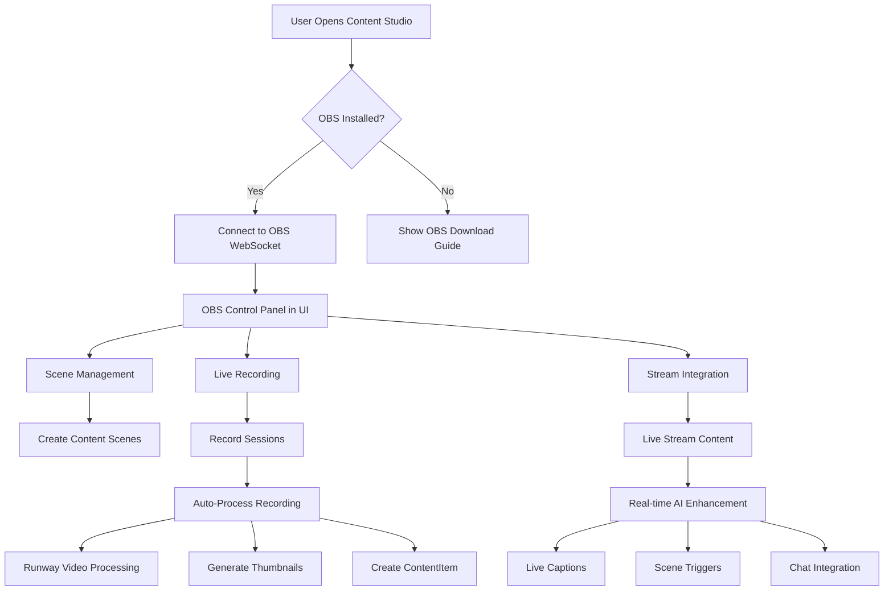
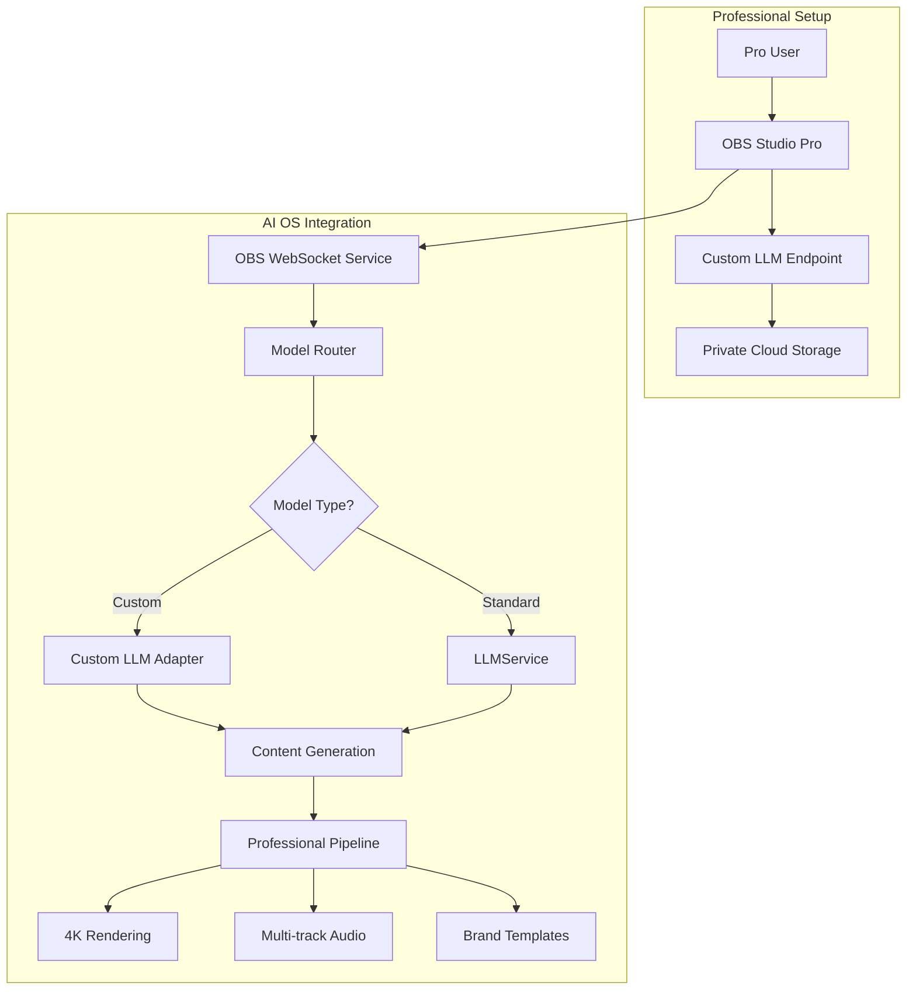
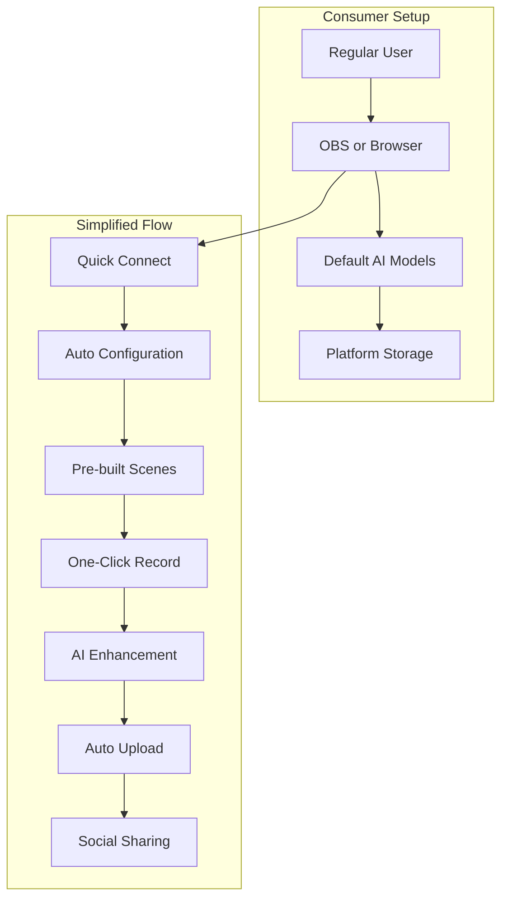

# OBS Integration Design for Donkey Betz Platform Platform

## Overview

This document outlines the comprehensive design for integrating OBS (Open Broadcaster Software) into the Donkey Betz Platform platform, transforming it into a true AI Operating System that supports both professional users with custom LLMs and consumers using default models.

## OBS API Integration Analysis

Based on my review of the OBS WebSocket API and your project's content creation capabilities, here's how OBS could enhance your platform:

### Key Integration Opportunities

**1. Live Content Creation Studio**
- Stream directly from OBS while creating content (memes, achievement videos, presentations)
- Real-time scene switching for professional content production
- Automated recording of content creation sessions

**2. AI-Enhanced Live Streaming**
- Trigger scene changes based on AI analysis of content
- Automatic captions/overlays from your AI agents
- Dynamic background replacement using your image generation services

**3. Content Pipeline Integration**
- Auto-capture OBS recordings → Process with Runway API → Store in ContentItem
- Generate thumbnails from OBS snapshots
- Create multi-camera content packages

**4. Business Presentation Tools**
- Live pitch recording for BusinessPlan model
- Professional webinar/demo recording
- Screen + webcam capture for tutorials

### Technical Integration Points

**1. WebSocket Service** (New)
```python
backend/content/services/obs_websocket_service.py
- Connect/disconnect management
- Event subscription handling
- Request/response communication
```

**2. Content Models Extension**
- Add `obs_recording_id` to ContentItem
- New `LiveStreamSession` model for tracking streams
- Link OBS scenes to ContentTemplate

**3. API Endpoints**
```
/api/content/obs/connect/
/api/content/obs/scenes/
/api/content/obs/record/start/
/api/content/obs/stream/status/
```

### Implementation Architecture

**1. Backend Service Layer**
- Async WebSocket client using `websockets` library
- Event-driven architecture for OBS events
- Queue system for processing recordings

**2. Frontend Integration**
- OBS control panel in content creation UI
- Live preview of OBS output
- Scene/source management interface

**3. Workflow Automation**
- Celery tasks for post-recording processing
- Integration with existing video generation pipeline
- Automatic upload to cloud storage

### Security Considerations
- Secure WebSocket authentication
- User-specific OBS instances
- Rate limiting for API calls
- Encrypted storage of OBS credentials

## OBS Integration Workflow Design

### Core Workflow Overview



### Detailed Workflows

#### 1. **Initial Setup Workflow**
```
1. User navigates to Content Studio
2. System detects if OBS is running
3. If not connected:
   - Display "Connect OBS" button
   - User enters WebSocket password
   - System validates connection
4. Save connection settings per user
5. Display OBS status indicator
```

#### 2. **Content Recording Workflow**
```
1. User selects "Create with OBS" option
2. System displays OBS preview window
3. User configures:
   - Scene selection/creation
   - Audio sources
   - Video quality settings
4. User clicks "Start Recording"
5. System:
   - Triggers OBS recording
   - Shows recording timer
   - Monitors disk space
6. User clicks "Stop Recording"
7. Auto-processing begins:
   - Upload to cloud storage
   - Generate preview thumbnails
   - Extract metadata (duration, resolution)
   - Queue for AI enhancement
8. Create ContentItem with OBS metadata
```

#### 3. **Live Streaming Workflow**
```
1. User selects "Go Live with AI"
2. System checks streaming settings
3. Pre-stream setup:
   - Select AI agents for assistance
   - Configure auto-scene switching
   - Set up chat moderation
4. Start streaming:
   - OBS begins stream
   - AI monitors content
   - Real-time enhancements
5. During stream:
   - AI generates captions
   - Triggers scene changes
   - Responds to chat
6. Post-stream:
   - Save VOD
   - Generate highlights
   - Create social clips
```

#### 4. **AI-Enhanced Production Workflow**
```
1. User creates "Smart Scene" template
2. Define triggers:
   - Keywords in speech
   - Time-based changes
   - AI agent responses
3. During recording/streaming:
   - Speech-to-text monitoring
   - AI analyzes content
   - Automatic scene switching
   - Dynamic overlay updates
4. Example scenarios:
   - Show code when discussing programming
   - Display charts during data talk
   - Switch to face cam for Q&A
```

### Pros of OBS Integration

**Technical Benefits:**
- Professional-quality content creation
- Hardware encoding support (better performance)
- Multi-source compositing (webcam + screen + overlays)
- Built-in streaming to multiple platforms
- Plugin ecosystem compatibility

**User Experience Benefits:**
- Familiar tool for content creators
- Real-time preview and control
- Professional transitions and effects
- Audio mixing capabilities
- Scene presets and templates

**Business Benefits:**
- Differentiation from competitors
- Appeals to serious content creators
- Enables live commerce/courses
- Professional webinar capabilities
- Reduced reliance on third-party tools

**AI Integration Benefits:**
- Real-time content analysis
- Automated production assistance
- Smart scene management
- Live transcription/translation
- Content moderation

### Cons of OBS Integration

**Technical Challenges:**
- Complexity of WebSocket implementation
- Cross-platform compatibility issues
- Network latency concerns
- Storage requirements for recordings
- CPU/GPU resource usage

**User Experience Challenges:**
- Learning curve for new users
- OBS installation requirement
- Configuration complexity
- Potential for user errors
- Desktop-only limitation

**Development Costs:**
- Significant development time
- Ongoing maintenance burden
- Testing across OBS versions
- Support documentation needs
- Additional infrastructure costs

**Security Concerns:**
- WebSocket authentication
- Local network exposure
- User privacy (screen capture)
- Streaming key management
- Content moderation at scale

### Alternative Approaches

**1. Browser-Based Recording**
- Use WebRTC for in-browser recording
- No installation required
- Limited to browser capabilities
- Simpler but less powerful

**2. Cloud Streaming Service**
- Partner with StreamYard/Restream
- Fully cloud-based solution
- Monthly costs per user
- Less control over features

**3. Mobile-First Approach**
- Focus on mobile content creation
- Use native device capabilities
- Different user demographic
- Simpler technical requirements

### Recommended Implementation Phases

**Phase 1: Basic Integration (COMPLETED ✅)**
- WebSocket connection management
- Scene listing and switching
- Start/stop recording
- Basic status monitoring

**Phase 2: Content Pipeline (COMPLETED ✅)**
- Automatic upload and processing
- Thumbnail generation
- ContentItem creation
- Basic metadata extraction

**Phase 3: AI Enhancement (COMPLETED ✅)**
- Real-time transcription
- Smart scene switching
- AI-powered overlays
- Content analysis

**Phase 4: Advanced Features (COMPLETED ✅)**
- Multi-platform streaming
- Collaborative production
- Advanced automation
- Analytics and insights

### Implementation Status (July 29, 2025)

All four phases have been successfully implemented:

**Phase 1 & 2: Core Infrastructure**
- ✅ Django app with models, serializers, views
- ✅ RESTful API endpoints for CRUD operations
- ✅ Async WebSocket service layer
- ✅ Scene and recording management

**Phase 3: Real-Time Communication**
- ✅ Django Channels WebSocket consumer
- ✅ Bidirectional event handling
- ✅ Real-time OBS status updates
- ✅ Celery task integration

**Phase 4: Advanced Features**
- ✅ Automation service with smart scene switching
- ✅ Multi-platform streaming support
- ✅ Real-time monitoring and analytics
- ✅ AI content pipeline integration

**Key Services Created:**
1. `OBSWebSocketService` - Core OBS communication
2. `OBSSceneService` - Scene management and templates
3. `OBSRecordingService` - Recording lifecycle
4. `OBSAutomationService` - Smart automation rules
5. `OBSStreamService` - Multi-platform streaming
6. `OBSMonitoringService` - Performance analytics
7. `OBSContentIntegration` - AI enhancement pipeline

### Technical Requirements

**Backend:**
- WebSocket client library (websockets/asyncio)
- Video processing pipeline (FFmpeg)
- Cloud storage integration (S3/GCS)
- Queue system for processing (Celery)
- Real-time event handling

**Frontend:**
- WebSocket connection management
- Video preview component
- OBS control interface
- Recording status indicators
- Scene management UI

**Infrastructure:**
- Increased storage capacity
- Video transcoding servers
- WebSocket proxy/load balancing
- CDN for video delivery
- Monitoring and logging

### Risk Mitigation

1. **Start with opt-in beta** - Limited rollout to power users
2. **Provide fallback options** - Keep existing creation tools
3. **Comprehensive documentation** - Video tutorials and guides
4. **Community support** - Discord/forum for users
5. **Gradual feature rollout** - Start simple, add complexity

## OBS Integration as AI OS Module - Complete Workflow Design

### Architecture Overview: Model-Agnostic AI OS

Your platform functions as an AI Operating System where OBS becomes another "driver" that can interface with any AI model or service. Here's how it integrates:

```
┌─────────────────────────────────────────────────────────┐
│                    AI OS Core                           │
├─────────────────────────────────────────────────────────┤
│  Model Abstraction Layer (LLMService)                   │
│  ┌─────────┬────────┬─────────┬──────────┬─────────┐  │
│  │ OpenAI  │ Claude │ Gemini  │ Custom   │ Ollama  │  │
│  └─────────┴────────┴─────────┴──────────┴─────────┘  │
├─────────────────────────────────────────────────────────┤
│  Media Services Layer                                   │
│  ┌──────────┬───────────┬─────────┬────────────────┐  │
│  │ Runway   │ElevenLabs │  OBS    │ Stable Diff   │  │
│  └──────────┴───────────┴─────────┴────────────────┘  │
├─────────────────────────────────────────────────────────┤
│  Agent Orchestra & Content Factory                      │
└─────────────────────────────────────────────────────────┘
```

### OBS Service Architecture

```python
# backend/content/services/obs_service.py
class OBSService:
    """Model-agnostic OBS integration service"""
    
    def __init__(self, user, model_preferences=None):
        self.user = user
        self.model_config = self._load_model_config(model_preferences)
        self.websocket_client = None
        self.is_professional = self._determine_user_tier()
```

### Workflow 1: Professional User with Custom LLM



**Professional Features:**
- Custom model endpoints (Azure OpenAI, private Llama, etc.)
- High-quality presets (4K, ProRes, multi-bitrate)
- Advanced scene automation
- Multi-camera switching
- Professional audio routing
- Brand guideline enforcement
- Batch processing queues

### Workflow 2: Consumer User with Default Models



**Consumer Features:**
- Browser-based alternative (WebRTC)
- Auto-configuration wizard
- Pre-built scene templates
- Simplified controls
- Automatic quality optimization
- One-click social sharing

### Implementation: Model-Agnostic Design

#### 1. **OBS WebSocket Consumer**
```python
# backend/content/consumers/obs_consumer.py
class OBSWebSocketConsumer(AsyncWebsocketConsumer):
    async def connect(self):
        self.user = self.scope["user"]
        self.obs_service = OBSService(self.user)
        self.ai_processor = self._get_ai_processor()
        
    def _get_ai_processor(self):
        """Select AI processor based on user config"""
        user_config = UserAIConfig.objects.get(user=self.user)
        
        if user_config.use_custom_llm:
            return CustomLLMProcessor(
                endpoint=user_config.custom_endpoint,
                api_key=user_config.custom_api_key
            )
        else:
            return LLMService(
                provider=user_config.preferred_provider,
                model=user_config.preferred_model
            )
```

#### 2. **Scene Intelligence System**
```python
class SceneIntelligence:
    """AI-powered scene management"""
    
    async def analyze_content(self, audio_stream, video_frame):
        # Real-time content analysis
        transcript = await self.ai.transcribe(audio_stream)
        scene_analysis = await self.ai.analyze_frame(video_frame)
        
        # Determine optimal scene
        if "code" in transcript and scene_analysis.has_screen:
            return "code_display_scene"
        elif scene_analysis.presenter_speaking:
            return "presenter_focus_scene"
```

#### 3. **Multi-Model Content Pipeline**
```python
class ContentPipeline:
    async def process_recording(self, obs_recording):
        # Model-agnostic processing
        tasks = []
        
        # Transcription (Whisper, Assembly, Custom)
        if self.config.transcription_service == "whisper":
            tasks.append(self.whisper_transcribe(obs_recording))
        elif self.config.transcription_service == "custom":
            tasks.append(self.custom_transcribe(obs_recording))
            
        # Enhancement (Runway, Custom, Local)
        if self.config.video_enhancement == "runway":
            tasks.append(self.runway_enhance(obs_recording))
        elif self.config.video_enhancement == "local":
            tasks.append(self.local_ml_enhance(obs_recording))
            
        results = await asyncio.gather(*tasks)
        return self.compile_content_item(results)
```

### User Experience Flows

#### Professional User Journey
1. **Setup Phase**
   - Connect OBS with advanced auth
   - Configure custom model endpoints
   - Set up brand templates
   - Define automation rules

2. **Production Phase**
   - Multi-source recording
   - Real-time AI monitoring
   - Automated scene switching
   - Live collaboration tools

3. **Post-Production**
   - AI-enhanced editing
   - Multi-format export
   - Distribution automation
   - Analytics integration

#### Consumer User Journey
1. **Quick Start**
   - One-click OBS detection
   - Guided setup wizard
   - Template selection
   - Test recording

2. **Creation**
   - Simple record button
   - AI suggestions
   - Auto-enhancement
   - Preview & trim

3. **Sharing**
   - Platform gallery
   - Social media export
   - Embed codes
   - Basic analytics

### Integration with Existing Services

#### 1. **Agent Orchestra Integration**
```python
class OBSAgentIntegration:
    async def create_content_with_agents(self, topic):
        # Deploy research agents
        research = await self.orchestrator.deploy_agents(
            "research", topic
        )
        
        # Generate script with AI
        script = await self.content_factory.generate_script(
            research.results
        )
        
        # Configure OBS scenes
        await self.obs_service.setup_scenes_for_script(script)
        
        # Start recording with AI direction
        await self.obs_service.start_ai_directed_recording(script)
```

#### 2. **Content Factory Enhancement**
```python
CONTENT_FORMATS['live_presentation'] = {
    'name': 'Live AI Presentation',
    'generator': 'obs_live',
    'requires': ['obs_connection'],
    'estimated_time': 0,  # Real-time
    'platforms': ['youtube', 'twitch', 'linkedin_live']
}
```

#### 3. **Video Generation Service Integration**
```python
class EnhancedVideoService:
    async def process_obs_recording(self, recording_path):
        # Extract key moments
        highlights = await self.ai_analyze_recording(recording_path)
        
        # Generate enhanced clips
        for highlight in highlights:
            enhanced = await self.runway_service.enhance_clip(
                highlight,
                style="professional"
            )
            
        # Add AI voiceover
        voiceover = await self.elevenlabs_service.generate_narration(
            self.ai_summarize(highlights)
        )
```

### Security & Privacy Considerations

#### Professional Users
- VPN/tunnel support for remote OBS
- Encrypted model communications
- Private storage options
- Audit logging
- RBAC for team access

#### Consumer Users
- Simplified permissions
- Automatic privacy filters
- GDPR compliance
- Content moderation
- Safe default settings

### Scalability Architecture

```python
# Microservice approach for scale
class OBSMicroservice:
    """Separate service for OBS operations"""
    
    def __init__(self):
        self.redis_queue = RedisQueue()
        self.celery = Celery()
        self.storage = S3Storage()
        
    async def handle_connection(self, user_id, obs_config):
        # Queue-based processing
        task = self.celery.send_task(
            'obs.connect',
            args=[user_id, obs_config],
            queue=self._get_user_queue(user_id)
        )
```

### Monetization Opportunities

1. **Tier-based Features**
   - Basic: 720p, standard models
   - Pro: 4K, custom models, priority processing
   - Enterprise: White-label, dedicated infrastructure

2. **Usage-based Pricing**
   - Recording hours
   - AI processing minutes
   - Storage capacity
   - Bandwidth usage

3. **Add-on Services**
   - Premium AI models
   - Professional templates
   - Priority support
   - Custom integrations

This design ensures OBS integration works seamlessly whether users have professional setups with custom LLMs or are casual creators using default models, truly embodying the AI OS concept.

## Summary

The OBS integration transforms Donkey Betz Platform into a comprehensive AI-powered content creation platform that serves both professional content creators with custom infrastructure and casual users with plug-and-play simplicity. By treating OBS as another modular component in the AI OS architecture, the platform maintains its model-agnostic approach while adding powerful live production capabilities.

Key benefits include:
- Professional-grade content creation tools
- Real-time AI enhancement and automation
- Seamless integration with existing services
- Scalable architecture for growth
- Multiple monetization opportunities
- Support for both professional and consumer use cases

The phased implementation approach ensures manageable development while providing value at each stage, ultimately creating a unique differentiator in the AI content creation space.