# Agent Selection Flowchart

## Overview
This flowchart helps you select the right AI agent for your task. Follow the decision tree from START to find the most suitable agent.

```mermaid
flowchart TD
    Start([Start: What do you need help with?]) --> TaskType{Task Type?}
    
    TaskType -->|Business/Strategy| BusinessCategory{Business Need?}
    TaskType -->|Financial/Investment| FinancialCategory{Financial Focus?}
    TaskType -->|Content/Creative| CreativeCategory{Creative Type?}
    TaskType -->|Technical/Research| TechnicalCategory{Technical Need?}
    TaskType -->|Marketing/Growth| MarketingCategory{Marketing Goal?}
    TaskType -->|Other| OtherCategory{Other Needs?}
    
    %% Business Branch
    BusinessCategory -->|Full Business Plan| BusinessAgent[Business Agent<br/>30 min • Heavy APIs]
    BusinessCategory -->|Strategy/Go-to-Market| BusinessStrategyAgent[Business Strategy Agent<br/>5 min • Medium APIs]
    BusinessCategory -->|Tech Startup| TechStartupAgent[Tech Startup Business Plan Agent<br/>5 min • No APIs]
    BusinessCategory -->|Government Contracts| GovContractAgent[Government Contract Scout Agent<br/>20 min • Heavy APIs]
    
    %% Financial Branch
    FinancialCategory -->|Stock Analysis| StockDecision{Stock Strategy?}
    FinancialCategory -->|Financial Modeling| FinancialAgent[Financial Agent<br/>25 min • Heavy APIs]
    FinancialCategory -->|Risk Management| RiskAgent[Risk Assessment Agent<br/>5 min • Light APIs]
    FinancialCategory -->|SaaS Metrics| SaaSAgent[SaaS Financial Modeling Agent<br/>5 min • Medium APIs]
    
    StockDecision -->|Day Trading| DayTradingAgent[Day Trading Strategy Agent<br/>5 min • Heavy APIs]
    StockDecision -->|Long Term| LongTermAgent[Long-Term Investment Agent<br/>5 min • Heavy APIs]
    StockDecision -->|Technical Analysis| TechnicalAgent[Technical Analysis Agent<br/>5 min • Medium APIs]
    StockDecision -->|General Analysis| StockAnalysisAgent[Stock Analysis Agent<br/>3 min • Light APIs]
    
    %% Creative Branch
    CreativeCategory -->|Content Writing| ContentAgent[Content Agent<br/>15 min • Medium APIs]
    CreativeCategory -->|Brand/Design| CreativeAgent[Creative Agent<br/>20 min • Medium APIs]
    CreativeCategory -->|Email Marketing| EmailAgent[Email Marketing Agent<br/>5 min • Light APIs]
    CreativeCategory -->|SEO| SEOAgent[SEO Specialist Agent<br/>5 min • Light APIs]
    
    %% Technical Branch
    TechnicalCategory -->|Deep Research| ResearchAgent[Research Agent<br/>10 min • Heavy APIs]
    TechnicalCategory -->|Reddit Ideas| RedditAgent[Reddit Scout Agent<br/>15 min • Medium APIs]
    TechnicalCategory -->|Code Analysis| SelfDevAgent[Self-Development Agent<br/>5 min • Medium APIs]
    TechnicalCategory -->|Data Analysis| DataAgent[Data Analyst<br/>5 min • No APIs]
    
    %% Marketing Branch
    MarketingCategory -->|Growth Strategy| MarketingAgent[Marketing Agent<br/>20 min • Heavy APIs]
    MarketingCategory -->|Campaign Creation| CampaignAgent[Campaign Creator Pro<br/>5 min • No APIs]
    MarketingCategory -->|Market Research| MarketResearchAgent[Market Research Specialist<br/>5 min • No APIs]
    
    %% Other Branch
    OtherCategory -->|Career Development| CareerAgent[Career Agent<br/>20 min • Medium APIs]
    OtherCategory -->|Legal/Compliance| LegalAgent[Legal Agent<br/>25 min • Heavy APIs]
    OtherCategory -->|Communication| CommunicationAgent[Communication Agent<br/>10 min • Medium APIs]
    OtherCategory -->|Operations| OperationsAgent[Operations Agent<br/>5 min • No APIs]
    
    %% Styling
    classDef quick fill:#90EE90,stroke:#006400,stroke-width:2px
    classDef medium fill:#FFD700,stroke:#B8860B,stroke-width:2px
    classDef long fill:#FFA07A,stroke:#DC143C,stroke-width:2px
    classDef noAPI fill:#E6E6FA,stroke:#4B0082,stroke-width:2px
    
    %% Apply styles based on execution time
    class BusinessStrategyAgent,TechStartupAgent,RiskAgent,SaaSAgent,DayTradingAgent,LongTermAgent,TechnicalAgent,StockAnalysisAgent,EmailAgent,SEOAgent,SelfDevAgent,DataAgent,CampaignAgent,MarketResearchAgent,OperationsAgent quick
    class ResearchAgent,CommunicationAgent medium
    class BusinessAgent,FinancialAgent,ContentAgent,CreativeAgent,RedditAgent,MarketingAgent,CareerAgent,LegalAgent long
    
    %% Apply no-API style
    class TechStartupAgent,DataAgent,CampaignAgent,MarketResearchAgent,OperationsAgent noAPI
```

## Quick Reference Guide

### By Execution Time

#### ⚡ Quick (< 5 minutes)
- **Stock Analysis Agent** (3 min) - Fastest for stock opportunities
- **Technical/Day Trading/Long-Term Agents** (5 min) - Specialized trading strategies
- **SEO/Email Marketing Agents** (5 min) - Specific marketing tasks
- **Campaign/Market Research Agents** (5 min) - Marketing planning
- **Operations/Data Analyst** (5 min) - Internal analysis

#### ⏱️ Medium (5-15 minutes)
- **Research Agent** (10 min) - Deep research tasks
- **Communication Agent** (10 min) - Professional communications
- **Content Agent** (15 min) - Content creation
- **Reddit Scout Agent** (15 min) - Idea discovery

#### ⏳ Long (15+ minutes)
- **Business Agent** (30 min) - Comprehensive business plans
- **Financial Agent** (25 min) - Financial projections
- **Legal Agent** (25 min) - Legal documents
- **Creative/Marketing Agents** (20 min) - Complex creative work
- **Career Agent** (20 min) - Career development
- **Government Contract Scout** (20 min) - Contract discovery

### By API Requirements

#### 🟢 No External APIs Required
- Operations Agent
- Data Analyst
- Campaign Creator Pro
- Market Research Specialist
- Tech Startup Business Plan Agent

#### 🟡 Light API Usage (1-3 APIs)
- Stock Analysis Agent
- Risk Assessment Agent
- Email Marketing Agent
- SEO Specialist Agent
- Technical Signal Agent

#### 🔴 Heavy API Usage (4+ APIs)
- Business Agent (6 APIs)
- Financial Agent (5 APIs)
- Research Agent (6 APIs)
- Marketing Agent (5 APIs)
- Legal Agent (5 APIs)

## Decision Criteria

### Choose Based on Task Specificity

1. **Need a complete business plan?**
   - Use **Business Agent** for comprehensive plans
   - Use **Tech Startup Business Plan Agent** for tech-specific plans

2. **Need financial analysis?**
   - Use **Financial Agent** for projections and models
   - Use **Stock Analysis Agent** for investment opportunities
   - Use **Risk Assessment Agent** for risk evaluation

3. **Need content creation?**
   - Use **Content Agent** for blogs and documentation
   - Use **Email Marketing Agent** for email campaigns
   - Use **Creative Agent** for branding

4. **Need research?**
   - Use **Research Agent** for deep analysis
   - Use **Reddit Scout Agent** for market opportunities
   - Use **Market Research Specialist** for market analysis

### Choose Based on Time Constraints

- **Have < 5 minutes?** Choose quick agents (green in flowchart)
- **Have 5-15 minutes?** Choose medium agents (yellow in flowchart)
- **Have 15+ minutes?** Choose comprehensive agents (orange in flowchart)

### Choose Based on API Availability

- **No API keys?** Choose no-API agents (purple in flowchart)
- **Limited APIs?** Choose light API agents
- **Full API access?** Any agent is available

## Multi-Agent Orchestration

For complex tasks, consider using multiple agents:

### Business Launch Package
1. **Reddit Scout Agent** → Discover market opportunity
2. **Market Research Specialist** → Validate market
3. **Business Strategy Agent** → Create go-to-market strategy
4. **Financial Agent** → Create financial projections
5. **Marketing Agent** → Develop marketing strategy

### Investment Research Package
1. **Stock Analysis Agent** → Identify opportunities
2. **Technical Analysis Agent** → Chart analysis
3. **Fundamental Analysis Agent** → Company evaluation
4. **Risk Assessment Agent** → Risk evaluation
5. **Stock Synthesis Agent** → Final recommendations

### Content Marketing Package
1. **SEO Specialist Agent** → Keyword research
2. **Content Agent** → Create content
3. **Email Marketing Agent** → Email campaigns
4. **Social Media Marketing Specialist** → Social strategy

## Tips for Agent Selection

1. **Start Specific**: Choose the most specialized agent for your task
2. **Consider Dependencies**: Check if you have required APIs
3. **Time Budget**: Match agent execution time to your deadline
4. **Iterate**: Use quick agents for exploration, then comprehensive agents for execution
5. **Combine Agents**: Use orchestration for complex multi-step tasks

## Common Mistakes to Avoid

1. ❌ Using Business Agent for simple market research (use Market Research Specialist)
2. ❌ Using Financial Agent for stock picks (use Stock Analysis Agent)
3. ❌ Using Creative Agent for simple content (use Content Agent)
4. ❌ Using heavy API agents without required keys
5. ❌ Not considering execution time for urgent tasks

## Need Help Choosing?

If you're still unsure which agent to use:

1. **Describe your task in detail**
2. **Identify the primary goal** (research, creation, analysis, etc.)
3. **Check your time constraints**
4. **Verify API availability**
5. **Start with a quick agent** to explore, then use specialized agents

Or simply ask: "Which agent should I use to [your task]?"