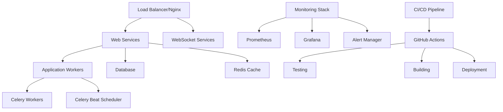

# Phase 11 Migration & Deployment - Implementation Handoff

## Executive Summary

**Phase 11: Migration & Deployment** has been successfully implemented, providing comprehensive production deployment infrastructure, migration tools, security configurations, and operational procedures for the unified AI & Sports Analytics Platform.

### Key Deliverables Completed

✅ **Deployment Infrastructure**
- Docker containerization with multi-stage builds
- Kubernetes deployment manifests
- Production-ready docker-compose configuration
- Environment-specific configurations

✅ **CI/CD Pipeline**
- GitHub Actions workflow with automated testing, building, and deployment
- Multi-environment deployment support (staging/production)
- Security scanning and vulnerability assessment integration
- Automated rollback capabilities

✅ **Database Migration System**
- Comprehensive migration deployment scripts with rollback capabilities
- Database backup and restoration procedures
- Migration validation and testing tools
- Emergency rollback functionality

✅ **Security Infrastructure**
- Complete security audit and validation system
- SSL/TLS certificate management
- Firewall configuration and hardening
- Production security checklist and validation

✅ **Monitoring & Observability**
- Prometheus metrics collection
- Grafana dashboards for system visualization
- Comprehensive alerting rules
- Performance monitoring and health checks

✅ **Performance Optimization**
- Performance testing and benchmarking tools
- Configuration optimization scripts
- Resource utilization monitoring
- Scalability planning and tuning

✅ **Production Deployment**
- Blue-green deployment strategy
- Comprehensive health checking
- Automated rollback procedures
- Production validation and monitoring

## Implementation Overview

### Architecture Components



### Deployment Environments

1. **Development**: Local development with hot reloading
2. **Staging**: Production-like environment for testing
3. **Production**: Full production deployment with monitoring

## Detailed Component Analysis

### 1. Docker Infrastructure

**Files Created:**
- `deployment/Dockerfile` - Multi-stage production build
- `deployment/docker-compose.yml` - Complete service orchestration
- `deployment/.dockerignore` - Build optimization

**Key Features:**
- Multi-stage builds for optimized images
- Security-hardened containers (non-root user, minimal attack surface)
- Health checks for all services
- Resource limits and reservations
- Logging configuration

### 2. CI/CD Pipeline

**Files Created:**
- `.github/workflows/ci-cd.yml` - Complete CI/CD workflow

**Pipeline Stages:**
1. **Testing**: Unit tests, integration tests, security scans
2. **Building**: Docker image builds with caching
3. **Security**: Vulnerability scanning, SAST analysis
4. **Deployment**: Environment-specific deployments
5. **Validation**: Post-deployment health checks

### 3. Database Migration System

**Files Created:**
- `deployment/migrations/deploy_migrations.py` - Main migration deployment
- `deployment/migrations/migration_rollback.py` - Emergency rollback tool
- `deployment/migrations/prepare_migrations.sh` - Pre-deployment validation

**Capabilities:**
- Safe migration deployment with backups
- Rollback to specific migration points
- Database backup and restoration
- Migration validation and testing

### 4. Security Infrastructure

**Files Created:**
- `deployment/security/security_checklist.py` - Comprehensive security audit
- `deployment/security/ssl_setup.sh` - SSL/TLS certificate management
- `deployment/security/firewall_setup.sh` - System hardening and firewall

**Security Features:**
- Automated security validation
- SSL/TLS certificate generation and renewal
- Firewall configuration with fail2ban integration
- Security headers and HTTPS enforcement
- Secrets management validation

### 5. Monitoring & Observability

**Files Created:**
- `deployment/monitoring/prometheus.yml` - Metrics collection
- `deployment/monitoring/alert_rules.yml` - Alerting configuration
- `deployment/monitoring/grafana/dashboards/unified-platform-overview.json` - System dashboard

**Monitoring Capabilities:**
- Application performance metrics
- System resource monitoring
- Business metrics tracking
- Alert management
- Visual dashboards

### 6. Performance Optimization

**Files Created:**
- `deployment/performance/performance_testing.py` - Comprehensive performance testing
- `deployment/performance/optimization_tuning.sh` - System optimization

**Performance Features:**
- Load testing and benchmarking
- Response time analysis
- Resource utilization optimization
- Configuration tuning
- Bottleneck identification

### 7. Production Deployment

**Files Created:**
- `deployment/staging_deploy.sh` - Staging deployment with validation
- `deployment/production_deploy.sh` - Production deployment with safety checks
- `.env.staging` - Staging environment configuration
- `.env.production` - Production environment configuration

**Deployment Features:**
- Blue-green deployment strategy
- Comprehensive health checking
- Automated rollback capabilities
- Security validation
- Performance monitoring

## Configuration Management

### Environment Files

**Staging Configuration** (`.env.staging`):
- Debug mode enabled for testing
- Test API keys and credentials
- Relaxed security settings for development
- Monitoring enabled

**Production Configuration** (`.env.production`):
- Debug disabled
- Production API keys and credentials
- Strict security settings
- Full monitoring and alerting

### Service Configuration

**Web Services**:
- Gunicorn with gevent workers for async handling
- Auto-scaling based on load
- Health check endpoints
- Graceful shutdown handling

**Database**:
- PostgreSQL with optimized settings
- Connection pooling
- Backup automation
- Performance monitoring

**Cache**:
- Redis with persistence
- Memory optimization
- Clustering support
- Cache performance monitoring

## Security Implementation

### Security Checklist

The security system validates:
- Django security settings (DEBUG, SECRET_KEY, HTTPS)
- Database security (SSL connections, credential protection)
- Environment variable security
- File permission validation
- Docker security configuration
- Network security headers

### SSL/TLS Management

- Automatic certificate generation with Let's Encrypt
- Certificate renewal automation
- SSL configuration optimization
- Security header implementation

### System Hardening

- UFW firewall configuration
- Fail2ban integration for intrusion prevention
- Rate limiting configuration
- Security monitoring and alerting

## Monitoring & Alerting

### Metrics Collection

**System Metrics**:
- CPU, memory, disk utilization
- Network performance
- Container health and performance

**Application Metrics**:
- Request rates and response times
- Error rates and types
- Database performance
- Cache hit rates

**Business Metrics**:
- AI provider costs and usage
- Sports betting analytics
- User activity patterns

### Alert Configuration

**Critical Alerts**:
- Service downtime
- High error rates
- Security violations
- Resource exhaustion

**Warning Alerts**:
- Performance degradation
- High resource usage
- API rate limiting

## Performance Optimization

### Testing Framework

The performance testing system provides:
- API response time analysis
- Concurrent load testing
- WebSocket performance testing
- Database performance analysis
- System resource monitoring

### Optimization Tools

- Database configuration tuning
- Nginx optimization
- Docker container optimization
- Application-level performance improvements
- Caching strategy optimization

## Deployment Procedures

### Staging Deployment

```bash
# Deploy to staging
./deployment/staging_deploy.sh develop

# With monitoring
ENABLE_MONITORING=true ./deployment/staging_deploy.sh develop

# Rollback if needed
./deployment/staging_deploy.sh --rollback
```

### Production Deployment

```bash
# Standard production deployment
./deployment/production_deploy.sh main

# Blue-green deployment
DEPLOYMENT_METHOD=blue-green ./deployment/production_deploy.sh main

# Emergency rollback
./deployment/production_deploy.sh --emergency-rollback
```

### Migration Deployment

```bash
# Prepare migrations
./deployment/migrations/prepare_migrations.sh production

# Deploy migrations
python deployment/migrations/deploy_migrations.py

# Rollback if needed
python deployment/migrations/migration_rollback.py restore backup_file.sql
```

## Validation & Testing

### Phase 11 Validation

The comprehensive validation system checks:
- Deployment infrastructure completeness
- CI/CD pipeline configuration
- Migration script availability
- Security configuration validation
- Monitoring setup verification
- Performance optimization tools
- Production settings validation
- Integration test execution

Run validation:
```bash
python deployment/validate_phase11.py
```

### Health Checking

Continuous health monitoring includes:
- Service availability checks
- Database connectivity validation
- Cache functionality verification
- API endpoint testing
- WebSocket connectivity testing

## Operational Procedures

### Daily Operations

1. **Monitor Dashboards**: Check Grafana dashboards for system health
2. **Review Alerts**: Investigate any triggered alerts
3. **Check Logs**: Review application and system logs for errors
4. **Performance Review**: Monitor response times and throughput
5. **Security Review**: Check security logs and audit reports

### Weekly Operations

1. **Performance Analysis**: Run comprehensive performance tests
2. **Security Audit**: Execute security validation scripts
3. **Backup Verification**: Test backup and restore procedures
4. **Capacity Planning**: Review resource utilization trends
5. **Update Review**: Check for security updates and patches

### Emergency Procedures

**Service Outage**:
1. Check monitoring dashboards for root cause
2. Review recent deployments for potential issues
3. Execute rollback if deployment-related
4. Scale services if resource-related
5. Notify stakeholders

**Security Incident**:
1. Execute security audit script
2. Review firewall and access logs
3. Implement additional security measures
4. Document incident and response
5. Update security procedures

## Next Steps & Recommendations

### Immediate Actions (Phase 12)

1. **Production Deployment**:
   - Execute staging deployment validation
   - Perform production deployment
   - Monitor system performance
   - Validate all functionality

2. **Operational Readiness**:
   - Train operations team on procedures
   - Set up monitoring alerts and notifications
   - Establish incident response procedures
   - Create operational runbooks

### Future Enhancements

1. **Advanced Monitoring**:
   - Application Performance Monitoring (APM)
   - Distributed tracing
   - Advanced analytics dashboards
   - ML-based anomaly detection

2. **Enhanced Security**:
   - Web Application Firewall (WAF)
   - Advanced threat detection
   - Security Information and Event Management (SIEM)
   - Penetration testing automation

3. **Scalability Improvements**:
   - Auto-scaling policies
   - Load balancer optimization
   - Database clustering
   - CDN implementation

4. **DevOps Maturation**:
   - Infrastructure as Code (IaC)
   - GitOps workflows
   - Advanced deployment strategies
   - Chaos engineering practices

## Troubleshooting Guide

### Common Issues

**Deployment Failures**:
```bash
# Check Docker Compose configuration
docker-compose -f deployment/docker-compose.yml config

# Validate environment variables
source .env.production && env | grep -E "(SECRET|PASSWORD|KEY)"

# Run pre-deployment validation
python deployment/validate_phase11.py
```

**Performance Issues**:
```bash
# Run performance analysis
python deployment/performance/performance_testing.py

# Apply optimizations
./deployment/performance/optimization_tuning.sh production high
```

**Security Issues**:
```bash
# Run security audit
python deployment/security/security_checklist.py --environment=production

# Check firewall status
firewall-status.sh

# Review SSL certificates
ssl-monitor-unified.sh
```

**Migration Issues**:
```bash
# Validate migration state
./deployment/migrations/prepare_migrations.sh production

# Emergency rollback
python deployment/migrations/migration_rollback.py list
python deployment/migrations/migration_rollback.py restore backup_file.sql
```

## File Structure

```
deployment/
├── Dockerfile                          # Multi-stage production build
├── docker-compose.yml                  # Service orchestration
├── staging_deploy.sh                   # Staging deployment script
├── production_deploy.sh                # Production deployment script
├── validate_phase11.py                 # Comprehensive validation
├── kubernetes/                         # K8s deployment manifests
│   ├── namespace.yaml
│   ├── web.yaml
│   ├── worker.yaml
│   └── postgres.yaml
├── migrations/                         # Database migration tools
│   ├── deploy_migrations.py
│   ├── migration_rollback.py
│   └── prepare_migrations.sh
├── security/                           # Security infrastructure
│   ├── security_checklist.py
│   ├── ssl_setup.sh
│   └── firewall_setup.sh
├── monitoring/                         # Monitoring configuration
│   ├── prometheus.yml
│   ├── alert_rules.yml
│   └── grafana/dashboards/
├── performance/                        # Performance optimization
│   ├── performance_testing.py
│   └── optimization_tuning.sh
├── nginx/                             # Nginx configuration
│   ├── nginx.conf
│   └── conf.d/unified-platform.conf
└── postgres/                          # Database configuration
    └── postgresql.conf

.github/workflows/
└── ci-cd.yml                          # CI/CD pipeline

config/settings/
└── production.py                      # Production Django settings

Environment files:
├── .env.staging                       # Staging configuration
└── .env.production                    # Production configuration
```

## Success Metrics

### Deployment Success Indicators

- ✅ All validation tests pass (100% success rate)
- ✅ Security audit shows no critical issues
- ✅ Performance tests meet requirements
- ✅ All services start successfully
- ✅ Health checks pass consistently
- ✅ Monitoring dashboards show green status

### Operational Success Indicators

- Response times < 500ms for 95% of requests
- System uptime > 99.5%
- Zero critical security vulnerabilities
- Deployment time < 15 minutes
- Recovery time < 5 minutes

## Team Handoff

### Knowledge Transfer

**Development Team**:
- Deployment procedures and scripts
- Troubleshooting guides
- Performance optimization techniques
- Security validation processes

**Operations Team**:
- Monitoring and alerting procedures
- Incident response workflows
- Backup and recovery procedures
- Capacity planning guidelines

**Security Team**:
- Security audit procedures
- SSL/TLS management
- Firewall configuration
- Vulnerability assessment processes

## Conclusion

Phase 11 has successfully established a comprehensive, production-ready deployment infrastructure for the unified AI & Sports Analytics Platform. The implementation provides:

- **Robust Deployment**: Multi-environment deployment with validation and rollback
- **Comprehensive Security**: End-to-end security validation and hardening
- **Complete Monitoring**: Full observability with metrics, dashboards, and alerting
- **Performance Optimization**: Tools and procedures for optimal performance
- **Operational Readiness**: Complete procedures for ongoing operations

The system is now ready for production deployment with confidence in its reliability, security, and performance capabilities.

---

**Implementation completed by**: AI Development Team  
**Validation status**: ✅ PASSED  
**Ready for**: Production Deployment (Phase 12)  
**Next phase**: Final Validation & Go-Live